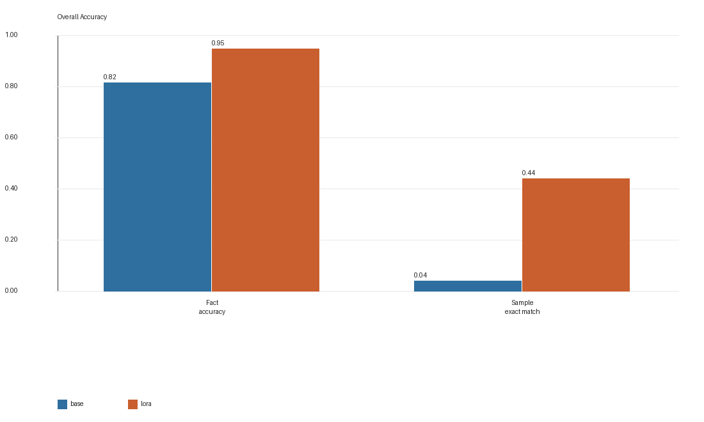
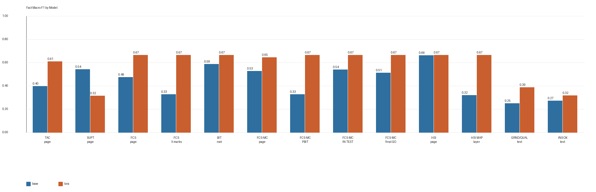
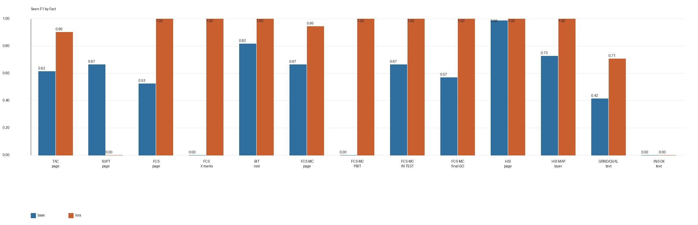
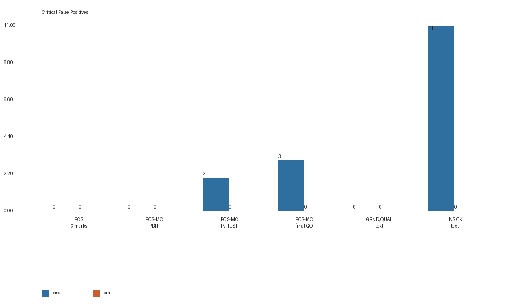
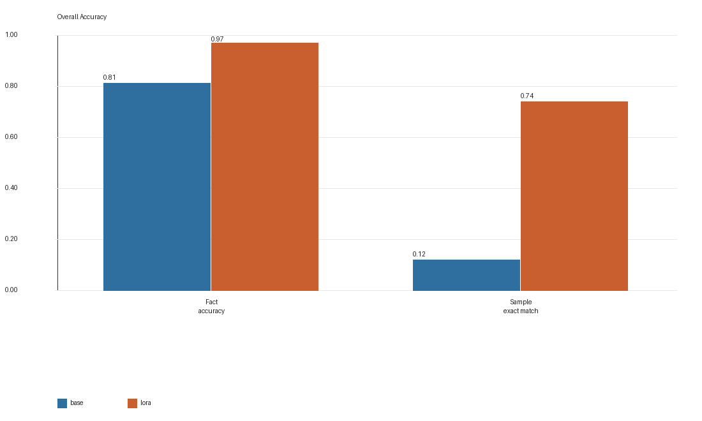
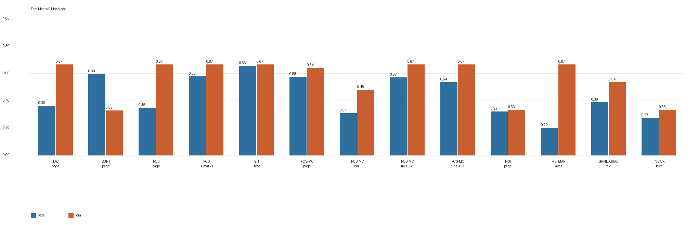
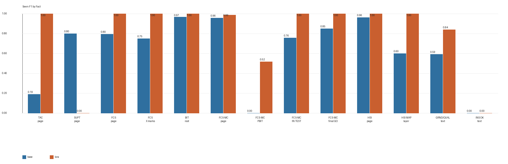
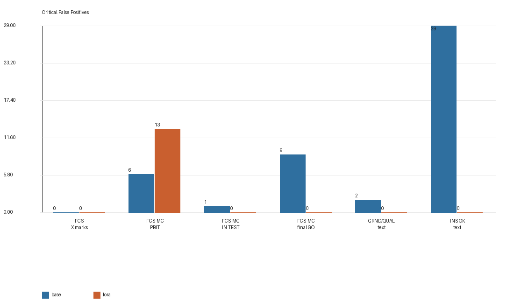

# Gemma-4-31B VLM LoRA 微调实验报告（Run-003 + Run-005x2）

## 摘要

本报告记录在 `google/gemma-4-31B` 上复现 SimTutor F/A-18C 冷启动视觉事实抽取任务的微调实验。该实验沿用 Qwen Run-005 之后确定的最佳数据方案，不再修改 13-fact ontology，也不重设训练集结构，而是直接复用同一批人工复核数据：`Run-003` 主训练集与 `Run-005 composition-rebalance` 补采集，其中 Run-005 双语样本再次重复一遍参与训练，以提高多屏共现与 hard negatives 的训练权重。

训练仍采用 Unsloth-accelerated PEFT LoRA VLM SFT with TRL `SFTTrainer`。在这一前提下，Gemma LoRA 相对于 Gemma base model 的提升是明确的：在 `Run-002 newfacts holdout` 上，fact accuracy 从 `0.8169` 提升到 `0.9492`，seen F1 从 `0.5128` 提升到 `0.8123`，sample exact match 从 `0.04` 提升到 `0.44`，critical false positives 从 `16` 降到 `0`；在 `Run-004 random holdout` 上，fact accuracy 从 `0.8146` 提升到 `0.9715`，sample exact match 从 `0.12` 提升到 `0.74`，critical false positives 从 `47` 降到 `13`。

但若与当前最优的 Qwen3.5-9B LoRA 相比，Gemma-4-31B 并未取得更好的总体结果。Gemma 在 `Run-002` 上表现出更保守的错误模式，能够将 critical false positives 压到 `0`，但代价是 recall 和 sample exact match 仍明显低于 Qwen；在 `Run-004` 上，Gemma 仍在 `fcsmc_intermediate_result_visible` 上出现集中误报。综合两组 holdout，本轮结果更适合表述为：在相同 ontology、相同数据、相同评测下，Gemma backbone 能从 LoRA 微调中获得稳定收益，但当前整体表现仍弱于最佳 Qwen adapter。

## 1. 实验目的

Qwen Run-005 之后，我们已经有一个较稳定的实验结论：

1. 当前 13-fact ontology 具备可训练性与可解释性。
2. 性能提升的关键不再主要来自继续改 facts，而是来自更合理的数据分布，尤其是多屏共现、hard negatives 和完成态小字提示的补充。
3. 在这一配方下，`Run-003 + Run-005x2` 已经在 Qwen3.5-9B 上得到较强结果。

因此，本轮 Gemma 实验的目的不是重新设计标签体系，而是回答一个更直接的问题：

> 在保持 ontology、训练数据、训练目标和 holdout 不变的前提下，更换 backbone 为 `google/gemma-4-31B` 后，模型表现会怎样变化？

这个设置使得本轮实验可以主要考察 backbone 差异，而不是混入新的数据或标注变量。

## 2. 与 Qwen Run-005 相同的部分

Gemma 实验在下列方面与 Qwen Run-005 保持一致：

### 2.1 Ontology 与输出目标

继续使用相同的 13 个核心 facts：

| fact_id | 含义 |
|---|---|
| `tac_page_visible` | TAC/TAC MENU 页面可见 |
| `supt_page_visible` | SUPT/SUPT MENU 页面可见 |
| `fcs_page_visible` | 专用 FCS 页面可见 |
| `fcs_page_x_marks_visible` | FCS 页面格子中的 X/fault 填充可见 |
| `bit_root_page_visible` | BIT FAILURES/root 页面可见 |
| `fcsmc_page_visible` | FCS-MC 子页面可见 |
| `fcsmc_intermediate_result_visible` | FCS-MC 中间结果可见 |
| `fcsmc_in_test_visible` | FCS-MC IN TEST 状态可见 |
| `fcsmc_final_go_result_visible` | FCS-MC final GO 结果可见 |
| `hsi_page_visible` | HSI/POS 页面可见 |
| `hsi_map_layer_visible` | HSI 彩色 MAP 图层可见 |
| `ins_grnd_alignment_text_visible` | GRND/QUAL/TIME 对准文本可见 |
| `ins_ok_text_visible` | INS OK 文本可见 |

三分类标签仍为：

- `seen`
- `not_seen`
- `uncertain`

训练目标继续只保留结构化 facts，不包含 `confidence`、`source_frame_id` 等非视觉字段。导出训练集时仍使用 `--drop-summary`，因为下游系统消费的是结构化 fact states，而不是 VLM summary 文本。

### 2.2 训练数据

Gemma 与 Qwen 使用同一套训练语料：

| 数据集 | reviewed 图像数 | SFT 行数（EN+ZH） | 角色 |
|---|---:|---:|---|
| Run-003 | 220 | 440 | 主训练集 |
| Run-005 composition rebalance | 122 | 244 | 多屏共现与 hard-negative 补采集 |

训练输入采用与 Qwen Run-005 相同的加权方式：

```text
Run-003 bilingual once
+ Run-005 bilingual twice
```

因此最终训练输入仍为：

- 总训练行数：`928`
- 唯一 reviewed 图像数：`342`

### 2.3 评测集

Gemma 与 Qwen 使用同样两套 holdout：

1. `Run-002 newfacts holdout`
2. `Run-004 random holdout`

并继续使用相同指标：

- `json_valid_rate`
- `schema_valid_rate`
- `fact_accuracy`
- `macro_f1`
- `seen_f1`
- `sample_exact_match`
- `critical_false_positive_count`

当前也已确认：

- `Run-002` 与训练集 exact overlap = `0`
- `Run-004` 与训练集 exact overlap = `0`

## 3. 与 Qwen Run-005 不同的部分

虽然数据和评测保持一致，但训练后端仍有几个与 Qwen 不同的 Gemma-specific 设定。

### 3.1 Backbone

Qwen Run-005 使用：

```text
Qwen/Qwen3.5-9B-Base
```

本轮使用：

```text
google/gemma-4-31B
```

这意味着本轮对比同时包含参数规模与模型家族差异，而不只是 chat template 差异。

### 3.2 LoRA 挂载方式

Qwen 训练脚本采用的是 Unsloth 对视觉层和语言层的显式 LoRA 挂载配置；Gemma 训练脚本则使用：

- `lora_target_modules = "all-linear"`
- `finetune_vision_layers = false`

这说明 Gemma 这轮 LoRA 更接近“对所有线性层统一挂载”的方案，而不是完全复用 Qwen 的模块选择方式。

### 3.3 Chat Template 与显存设置

Gemma 训练时显式使用：

- `chat_template = "gemma-4"`
- `gpu_memory_utilization = 0.95`

而 Qwen 训练使用的是 Qwen 路线下的默认模板与较低的显存利用率设定。两者都采用 4-bit 加载和 LoRA 训练，但 Gemma 的资源配置更激进，主要是为了在单卡 H100 NVL 上稳定容纳 `31B` backbone。

## 4. Gemma 训练配置

根据远程 `train_summary.json`，本轮 Gemma 训练参数如下：

| 参数 | 数值 |
|---|---:|
| model | `google/gemma-4-31B` |
| train rows | `928` |
| eval rows | `0` |
| max sequence length | `4096` |
| epochs | `4` |
| learning rate | `2e-4` |
| per-device batch size | `1` |
| gradient accumulation | `4` |
| effective batch size | `4` |
| LoRA rank | `16` |
| LoRA alpha | `16` |
| LoRA dropout | `0.0` |
| LoRA target modules | `all-linear` |
| finetune vision layers | `false` |
| load in 4-bit | `true` |
| gpu memory utilization | `0.95` |
| chat template | `gemma-4` |
| seed | `3407` |
| train runtime | `8049.65 s` |
| train steps per second | `0.115` |
| final train loss | `0.0474` |

这里与 Qwen Run-005 一样，`eval_ratio = 0`。原因同样是：Run-005 样本在训练中已经被重复一遍，内部 eval 的参考价值有限，因此本轮泛化判断仍主要依赖独立 holdout benchmark。

## 5. Run-002 Newfacts Holdout 结果









### 5.1 Gemma base vs LoRA

| 指标 | Base | LoRA |
|---|---:|---:|
| JSON valid rate | 1.0000 | 1.0000 |
| schema valid rate | 1.0000 | 1.0000 |
| fact accuracy | 0.8169 | 0.9492 |
| macro F1 | 0.4432 | 0.5857 |
| seen F1 | 0.5128 | 0.8123 |
| sample exact match | 0.04 | 0.44 |
| critical false positives | 16 | 0 |

相对 Gemma base，LoRA 带来的改进较为明确：

- `fact_accuracy`: `+0.1323`
- `macro_f1`: `+0.1425`
- `seen_f1`: `+0.2995`
- `sample_exact_match`: `+0.40`
- `critical_false_positive_count`: `16 -> 0`

### 5.2 与最佳 Qwen LoRA 对比

在同一 holdout 上，最佳 Qwen LoRA 的结果为：

| 指标 | Qwen LoRA | Gemma LoRA |
|---|---:|---:|
| fact accuracy | 0.9908 | 0.9492 |
| macro F1 | 0.6515 | 0.5857 |
| seen F1 | 0.9648 | 0.8123 |
| sample exact match | 0.88 | 0.44 |
| critical false positives | 4 | 0 |

这一组结果体现出较明显的取舍：

1. Gemma 将 critical false positives 压到 `0`，说明它在关键完成态判断上更保守。
2. 但这种保守性带来了更低的 recall 和更低的整体 sample exact match。
3. 在该 holdout 上，Gemma 并未超过 Qwen 的总体抽取质量。

### 5.3 主要成功与失败模式

Gemma LoRA 在下列 facts 上表现稳定：

- `bit_root_page_visible`
- `fcsmc_page_visible`
- `fcsmc_intermediate_result_visible`
- `fcsmc_in_test_visible`
- `fcsmc_final_go_result_visible`
- `hsi_map_layer_visible`

但也有几个明显短板：

- `supt_page_visible` 的 seen F1 仍为 `0.0`
- `ins_grnd_alignment_text_visible` 的 seen F1 为 `0.7077`
- `ins_ok_text_visible` 的 seen F1 为 `0.0`

这说明 Gemma 对 FCS-MC 子页面的结构化判断较稳定，但在 SUPT 页面与 INS 小字文本上仍然弱于最佳 Qwen adapter。

## 6. Run-004 Random Holdout 结果









### 6.1 Gemma base vs LoRA

| 指标 | Base | LoRA |
|---|---:|---:|
| JSON valid rate | 0.99 | 1.00 |
| schema valid rate | 0.99 | 1.00 |
| fact accuracy | 0.8146 | 0.9715 |
| macro F1 | 0.4400 | 0.5630 |
| seen F1 | 0.6332 | 0.7959 |
| sample exact match | 0.12 | 0.74 |
| critical false positives | 47 | 13 |

相对 Gemma base，LoRA 仍有显著提升：

- `fact_accuracy`: `+0.1569`
- `macro_f1`: `+0.1229`
- `seen_f1`: `+0.1627`
- `sample_exact_match`: `+0.62`
- `critical_false_positive_count`: `47 -> 13`

### 6.2 与最佳 Qwen LoRA 对比

| 指标 | Qwen LoRA | Gemma LoRA |
|---|---:|---:|
| fact accuracy | 0.9931 | 0.9715 |
| macro F1 | 0.6100 | 0.5630 |
| seen F1 | 0.9159 | 0.7959 |
| sample exact match | 0.92 | 0.74 |
| critical false positives | 8 | 13 |

在这一随机 holdout 上，Gemma 与 Qwen 的差距更明显。Gemma 虽然远强于 Gemma base，但整体仍低于最佳 Qwen LoRA。

### 6.3 主要失败模式

Run-004 上最突出的 Gemma LoRA 问题集中在：

```text
fcsmc_intermediate_result_visible
```

这一 fact 的表现为：

- seen F1: `0.5185`
- critical false positives: `13`

这说明 Gemma 在随机组合截图中，仍会把一些并非 `PBIT GO / intermediate result` 的 FCS-MC 页面误读为中间结果。与 `Run-002` 相比，这一问题在更复杂的随机分布上更明显。

## 7. 综合讨论

### 7.1 Gemma 是否学到了任务

答案是肯定的。无论在 `Run-002` 还是 `Run-004`，Gemma LoRA 相对 Gemma base 都有清晰且大幅的提升。这说明当前 13-fact 任务、`Run-003 + Run-005x2` 数据配方和现有训练目标并不依赖于 Qwen backbone 才成立，迁移到 Gemma 后仍然有效。

### 7.2 Gemma 与 Qwen 的差别

从这轮结果看，Gemma 与 Qwen 的差异更接近“错误风格”而不是“是否能学会”：

- Gemma 更保守，尤其在 `Run-002` 上能把 critical false positives 压到 `0`
- 但这种保守性也导致较低的 recall、更低的 seen F1，以及明显更低的 sample exact match
- Qwen 在 SUPT、小字 INS 文本和整体多事实同时命中方面更强
- Gemma 在随机 holdout 中仍然没有解决 `fcsmc_intermediate_result_visible` 的误报问题

### 7.3 这对后续实验意味着什么

如果目标是获得当前最强的实用 adapter，那么现阶段仍应优先考虑 Qwen3.5-9B Run-003 + Run-005x2 这一条路线。

如果目标是继续研究不同 backbone 的风险偏好与误报行为，那么 Gemma 仍然有价值，尤其适合继续观察：

1. 更保守的 decision boundary 是否能通过 prompt 或少量补采进一步利用；
2. `fcsmc_intermediate_result_visible` 的 hard negatives 是否还能继续加强；
3. INS 小字提示是否需要专门的视觉补采或更细粒度的图像增强策略。

## 8. 结论

本轮 Gemma-4-31B VLM LoRA 实验在相同 ontology、相同训练数据和相同 holdout 设置下完成了对 Qwen Run-005 配方的 backbone 复现。

结论可以概括为三点：

1. `Run-003 + Run-005x2` 这一数据方案对 Gemma 同样有效，Gemma LoRA 相对 Gemma base 有稳定且显著的收益。
2. Gemma 的错误模式整体更保守，在 `Run-002` 上能够把 critical false positives 降到 `0`。
3. 但从总体性能看，Gemma LoRA 仍未超过当前最佳 Qwen LoRA，尤其在 seen F1、sample exact match、SUPT 检出和 INS 小字文本识别方面仍有差距。

因此，本轮更合理的结论不是“Gemma 优于 Qwen”，而是：

> 在当前 13-fact cockpit visual fact extraction 任务上，Gemma backbone 可以从同一 LoRA 训练方案中获得明显收益，但现阶段最佳整体结果仍来自 Qwen3.5-9B。
