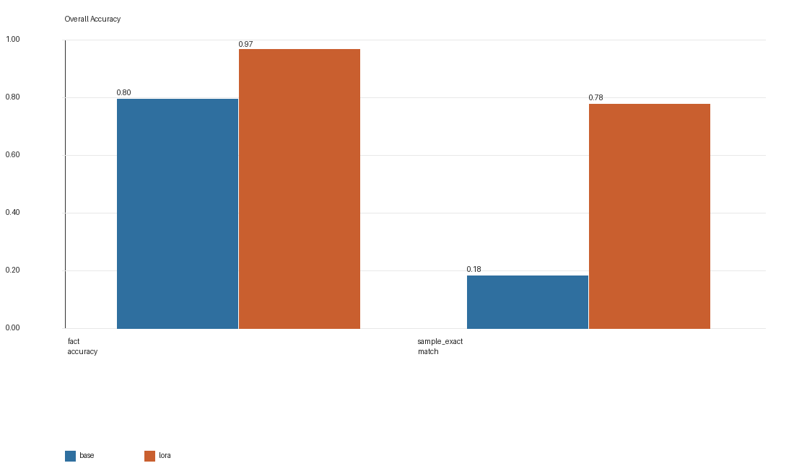
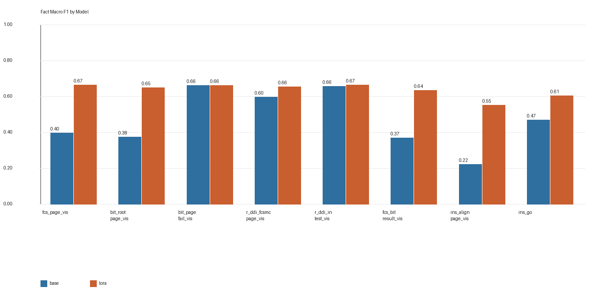
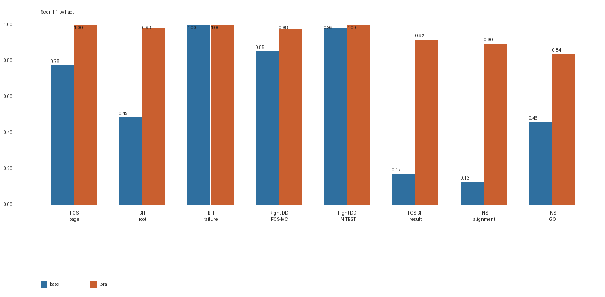
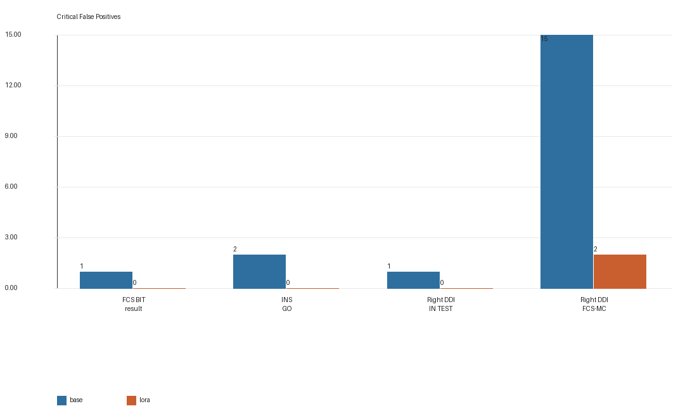
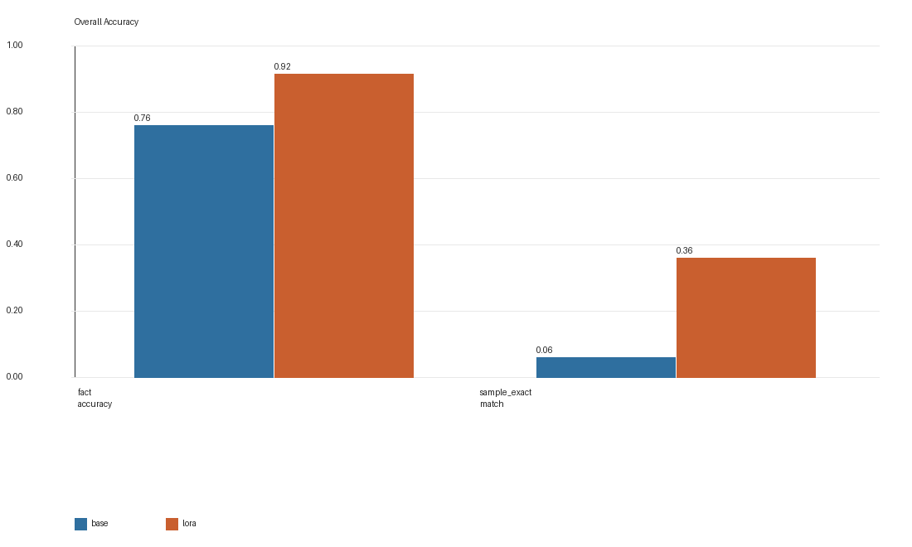
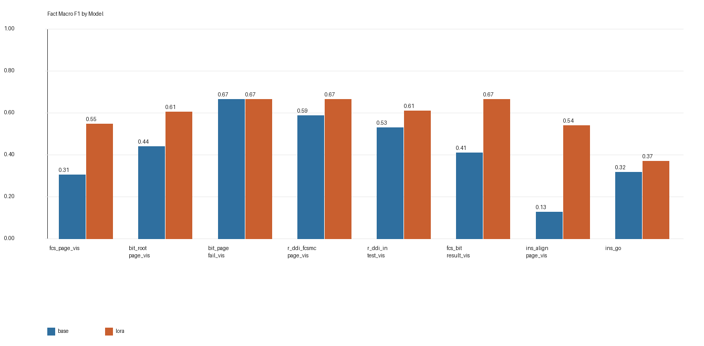
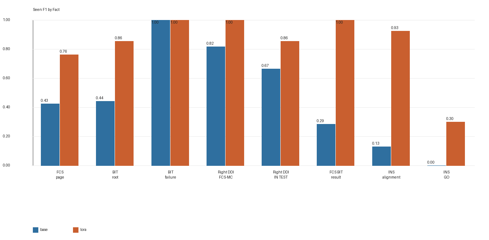
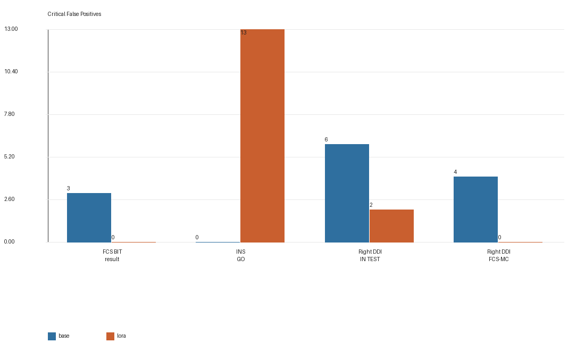
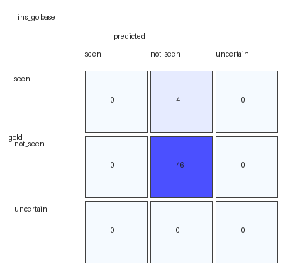

# Qwen3.5-9B VLM 在 SimTutor 座舱视觉事实抽取任务上的 LoRA 微调实验报告

## 摘要

本报告研究一个面向任务型多模态系统的具体问题：在 F/A-18C 冷启动场景中，少量人工复核的 cockpit 图像是否足以让 `Qwen/Qwen3.5-9B-Base` 学会稳定抽取结构化视觉事实。实验采用单张组合屏图像作为输入，要求模型输出 8 个核心 visual facts 的 JSON 标签。训练栈为 Unsloth VLM 加载与 4-bit/LoRA 适配、PEFT LoRA adapter，以及 TRL `SFTTrainer` 监督微调循环；训练数据来自 Run-001 的 180 张人工复核图像，并导出为英文和中文两套 SFT 样本，共 360 条。评测分两层：Run-001 contaminated development set 用于快速回归检查，Run-002 heldout new session 用于独立会话泛化评估。

结果显示，LoRA-v1 在结构化输出稳定性和多数 cockpit facts 上显著优于 base model。在 Run-002 上，fact accuracy 从 `0.7600` 提升至 `0.9150`，seen F1 从 `0.4714` 提升至 `0.8380`。然而，`ins_go` 在 Run-002 中出现 13 个 false positives，表明当前 target ontology 将较高层流程状态压缩为单帧视觉事实，存在抽象层级不合理的问题。因此，本实验支持“领域内小规模人工复核数据可以显著提升 VLM 结构化视觉抽取能力”的结论，但也表明后续研究需要重新设计部分 facts，尤其是将 `ins_go` 拆解为更低层、可直接观察的视觉证据。

## 1. 领域背景：什么是 Cockpit Visual Facts

F/A-18C 是本项目在 DCS 模拟环境中使用的飞机座舱。冷启动任务指从飞机未完全上电或未完成系统准备的状态开始，逐步完成若干系统检查和对准步骤。座舱中有多个多功能显示屏，其中本实验关注三个固定区域：

| 区域 | 含义 | 在图像中的角色 |
|---|---|---|
| `left_ddi` | Left Digital Display Indicator，左侧 DDI | 显示系统页面、BIT 页面、FCS 页面等 |
| `ampcd` | Advanced Multipurpose Color Display，中下方彩色显示屏 | 常显示地图、INS 对准页面、导航信息 |
| `right_ddi` | Right Digital Display Indicator，右侧 DDI | 显示测试状态、FCS-MC 页面、BIT 状态等 |

在本报告中，`fact` 指“从单张 cockpit 屏幕图像中抽取出的、可被下游状态推理模块使用的结构化视觉命题”。它不是自然语言描述，也不是最终任务决策，而是视觉感知层和任务推理层之间的中间表示。每个 fact 的状态为三分类：

| 状态 | 含义 |
|---|---|
| `seen` | 当前图像中能明确看到该视觉事实 |
| `not_seen` | 当前图像中没有看到该视觉事实 |
| `uncertain` | 图像模糊、遮挡、状态不完整，或单帧证据不足 |

首轮实验使用 8 个核心 facts：

| fact_id | 通俗含义 | 为什么重要 |
|---|---|---|
| `fcs_page_visible` | 是否能看到飞控系统 FCS 页面 | 判断飞控相关页面是否已进入可检查状态 |
| `bit_root_page_visible` | 是否能看到内建测试 BIT 的主/根页面 | 判断是否处于 BIT 菜单或测试入口附近 |
| `bit_page_failure_visible` | 是否能看到 BIT failure 列表页面 | 判断系统是否显示测试失败/状态列表 |
| `right_ddi_fcsmc_page_visible` | 右侧 DDI 是否显示 FCS-MC 相关页面 | 判断飞控计算机测试页面是否可见 |
| `right_ddi_in_test_visible` | 右侧 DDI 是否明确显示测试正在进行 | 判断测试过程是否仍在运行 |
| `fcs_bit_result_visible` | 是否能看到 FCS BIT 的最终结果 | 判断 FCS BIT 是否显示可用的结果状态 |
| `ins_alignment_page_visible` | AMPCD 是否显示 INS 对准页面 | 判断惯性导航对准流程是否可见 |
| `ins_go` | 是否能看到 INS 已达到 GO 状态 | 判断 INS 对准是否出现完成信号 |

这些 facts 对应冷启动流程中的视觉检查点。下游系统可以基于这些 facts 判断当前步骤是否完成、是否需要等待或是否需要继续观察。需要强调的是，这 8 个 facts 是首轮工程抽象，用于快速闭合训练、标注和评测链路，并不是最终最佳的视觉 ontology。

## 2. 系统架构背景

SimTutor 的视觉链路采用分层设计：

```text
DCS viewport screenshot
  -> VLM-ready composite panel image
  -> VLM visual fact extraction
  -> downstream task/state reasoning
```

第一层将 DCS 中的视口导出截图裁剪/渲染为 VLM-ready artifact。第二层由 VLM 负责从图像中抽取结构化 facts。第三层由任务推理模块结合 visual facts、procedure context 和 telemetry 进行状态判断。

本实验没有让 VLM 直接生成 tutor answer 或任务推进建议，原因有三点。第一，直接自然语言回答难以做严格评测，错误也不容易定位。第二，结构化 facts 更适合人工复核、回放和对比分析。第三，任务推进通常不应只依赖单帧视觉模型，而应由下游状态推理模块结合时间、程序上下文和传感器状态决定。

输入图像采用单张组合屏方案，而不是把 `left_ddi`、`ampcd`、`right_ddi` 拆成三张图。这样做的主要目的是保持训练、初标、评测和系统推理时的输入分布一致，避免“训练时三图输入、评测或系统使用时单图输入”的 distribution mismatch。模型 prompt 会明确说明组合图中三个固定区域的语义，但图像本身仍是一张整体 artifact。

## 3. 数据集构建

数据构建流程如下：

```text
DCS 截图采集
  -> 渲染为 VLM-ready artifact
  -> Qwen 397B VLM 初标
  -> Label Studio 人工复核
  -> reviewed JSONL
  -> OpenAI-compatible multimodal chat SFT JSONL
```

Run-001 来自 `fa18c-coldstart-run-001`，包含 180 张人工复核图像。该数据被导出为英文和中文两套 SFT 样本，每种语言各 180 条，共 360 条。LoRA-v1 使用这 360 条样本训练，并将其中 10% 作为训练内 eval split。因此，Run-001 benchmark 被标记为 contaminated development set，只能作为快速回归检查，不能作为独立泛化结论。

Run-002 来自 `fa18c-coldstart-run-002`，包含 50 张人工复核图像。该数据不参与 LoRA-v1 训练，只用于 heldout new session 评测。Run-002 中包含一些 Run-001 较少或不同的座舱界面，因此更能暴露泛化和 target ontology 的问题。

### 3.1 Run-001 标签分布

| fact_id | seen | not_seen | uncertain |
|---|---:|---:|---:|
| `fcs_page_visible` | 146 | 34 | 0 |
| `bit_root_page_visible` | 110 | 70 | 0 |
| `bit_page_failure_visible` | 110 | 69 | 1 |
| `right_ddi_fcsmc_page_visible` | 44 | 136 | 0 |
| `right_ddi_in_test_visible` | 27 | 153 | 0 |
| `fcs_bit_result_visible` | 20 | 159 | 1 |
| `ins_alignment_page_visible` | 113 | 67 | 0 |
| `ins_go` | 18 | 160 | 2 |

### 3.2 Run-002 标签分布

| fact_id | seen | not_seen | uncertain |
|---|---:|---:|---:|
| `fcs_page_visible` | 13 | 37 | 0 |
| `bit_root_page_visible` | 9 | 41 | 0 |
| `bit_page_failure_visible` | 9 | 41 | 0 |
| `right_ddi_fcsmc_page_visible` | 9 | 41 | 0 |
| `right_ddi_in_test_visible` | 6 | 44 | 0 |
| `fcs_bit_result_visible` | 3 | 47 | 0 |
| `ins_alignment_page_visible` | 43 | 7 | 0 |
| `ins_go` | 4 | 46 | 0 |

这两个分布都显示出明显类别不平衡。特别是 `fcs_bit_result_visible` 和 `ins_go` 的 seen 样本数量较少，但这两个 fact 对任务状态判断又比较关键。这种不平衡会使模型更难同时保持高 recall 和低 false positive。

## 4. 双语 SFT 数据格式

训练数据采用 OpenAI-compatible multimodal chat JSONL。每一行是一个完整样本，由 system message、user message 和 assistant message 组成。user message 同时包含图片和文本 instruction；assistant message 是监督目标 JSON。

### 4.1 英文样本结构

下面示例保留真实结构，但截断了 base64 图像：

```json
{
  "messages": [
    {
      "role": "system",
      "content": "You are SimTutor visual fact extractor. Reply with JSON only."
    },
    {
      "role": "user",
      "content": [
        {
          "type": "image_url",
          "image_url": {
            "url": "data:image/png;base64,iVBORw0KGgoAAAANSUhEUgAABEQAAAXo..."
          }
        },
        {
          "type": "text",
          "text": "You are the SimTutor visual fact extractor for the F/A-18C cold-start dataset. The input is exactly one composite-panel image. Its fixed top-to-bottom regions are: left_ddi, ampcd, right_ddi. Inspect only this image and output visual fact labels for the 8 core facts..."
        }
      ]
    },
    {
      "role": "assistant",
      "content": "{\"facts\":[{\"fact_id\":\"fcs_page_visible\",\"state\":\"not_seen\",\"evidence_note\":\"Left DDI screen is blank; no FCS page content is visible.\"},{\"fact_id\":\"bit_root_page_visible\",\"state\":\"not_seen\",\"evidence_note\":\"No BIT root menu is visible on any display.\"}],\"summary\":\"All three displays are powered on but show blank black screens with no visible data or pages.\"}"
    }
  ]
}
```

### 4.2 中文样本结构

中文版使用相同图像和相同事实标签，但 system/user instruction 为中文：

```json
{
  "messages": [
    {
      "role": "system",
      "content": "你是 SimTutor 的视觉事实抽取器。只能输出 JSON。"
    },
    {
      "role": "user",
      "content": [
        {
          "type": "image_url",
          "image_url": {
            "url": "data:image/png;base64,iVBORw0KGgoAAAANSUhEUgAABEQAAAXo..."
          }
        },
        {
          "type": "text",
          "text": "你是 SimTutor 的视觉事实抽取器，负责给 F/A-18C 冷启动数据集做视觉事实标注。输入只有一张组合面板图。这张图内部的固定区域从上到下依次是：left_ddi、ampcd、right_ddi..."
        }
      ]
    },
    {
      "role": "assistant",
      "content": "{\"facts\":[{\"fact_id\":\"fcs_page_visible\",\"state\":\"not_seen\",\"evidence_note\":\"Left DDI screen is blank; no FCS page content is visible.\"}],\"summary\":\"All three displays are powered on but show blank black screens with no visible data or pages.\"}"
    }
  ]
}
```

这种格式的设计有几个目的。首先，它与 Qwen/OpenAI-compatible multimodal chat API 的输入形式一致，也与 Unsloth/TRL 多模态 SFT 所需的 message 数据结构兼容。其次，它把学习目标限制为“图像 + 指令 -> 结构化 JSON facts”，减少模型学习无关输出形式的机会。第三，它让训练目标贴近后续系统需要解析的格式。

训练目标刻意不包含 `frame_id`、`session_id`、`artifact_image_path`、`raw_image_path`、`source_frame_id` 和 `confidence`。这些字段要么是数据管理 metadata，要么是由采集框架确定的外部索引，不应由视觉模型从图像中生成。`confidence` 也被排除，因为模型自报置信度通常未经校准，容易给下游推理造成错误安全感。视觉模型应输出可审查的状态和证据说明，而不是伪概率。

双语 SFT 的目的不是增加视觉状态多样性，而是增加 instruction diversity。英文和中文样本共享同一图像和同一事实标签，可以改善模型在中英文指令下的 JSON 输出稳定性；但它不能替代新的 cockpit 状态截图，也不能解决 hard negative 样本不足的问题。

## 5. 微调训练细节

微调模型为 `Qwen/Qwen3.5-9B-Base`。准确地说，本实验使用 Unsloth + PEFT LoRA + TRL `SFTTrainer` 的组合训练栈：Unsloth 负责 VLM 加载、4-bit 准备、LoRA 注入和视觉 batch collation；PEFT 定义 LoRA adapter 格式；TRL `SFTTrainer` 执行监督微调训练循环。LoRA adapter 输出目录为：

```text
/scratch/yz50/iefmmq_vlm_ft_unsloth/runs/full_qwen35_9b_base_bilingual_v1/adapter
```

训练使用 Run-001 的中英双语 SFT 数据，共 360 条样本，随机切分为 324 条训练样本和 36 条 eval 样本。关键参数如下：

| 参数 | 值 | 选择理由 |
|---|---:|---|
| `max_seq_length` | 4096 | 覆盖单图 instruction、8 个 facts 和 JSON 输出，同时控制显存 |
| `num_train_epochs` | 4 | 小数据集需要多次学习固定 schema 和 cockpit fact 边界；最终 eval loss 仍保持较低 |
| `learning_rate` | 2e-4 | LoRA SFT 常用快速域适配学习率 |
| `per_device_train_batch_size` | 1 | VLM 图像输入显存开销较大 |
| `gradient_accumulation_steps` | 4 | 在 batch size 1 下形成有效 batch size 4，提高梯度稳定性 |
| `lora_r` | 16 | 小数据领域适配的中等容量设置 |
| `lora_alpha` | 16 | 与 rank 匹配，保持 LoRA 更新幅度稳定 |
| `lora_dropout` | 0.0 | 首轮优先验证可学习性，避免额外正则引入不稳定 |
| `seed` | 3407 | 固定数据切分和训练随机性 |

4-bit LoRA 的选择主要来自资源和实验效率考虑。这里的 4-bit 加载和视觉模型准备由 Unsloth 完成，adapter 注入使用 PEFT/LoRA，训练循环由 TRL `SFTTrainer` 执行。完整微调 9B VLM 需要更高显存和更长训练时间，而本任务的数据规模较小、输出空间固定，LoRA 更适合作为首轮领域适配方法。`r=16` 与 `alpha=16` 提供中等参数容量，既允许模型学习 cockpit layout 和 JSON 输出格式，又尽量降低小数据集上过度记忆的风险。

epoch 数设置为 4 是一个首轮实验折中。由于训练样本只有 360 条，如果 epoch 太少，模型可能尚未稳定学习固定 JSON schema 和 8 个 fact 的边界；如果 epoch 太多，则更容易记忆 Run-001 的具体图像分布。最终训练记录为：

| 指标 | 数值 |
|---|---:|
| train rows | 324 |
| eval rows | 36 |
| train loss | 0.57036 |
| final eval loss | 0.03269 |
| train runtime | 2201s |

需要注意，eval split 来自 Run-001 同一数据池，因此只能说明训练内验证表现，并不能代表独立泛化能力。独立会话泛化主要由 Run-002 评估。

## 6. 评测方法

评测比较 base model 与加载 LoRA adapter 后的模型。两者接收相同的 reviewed JSONL 样本、相同图像和相同英文 prompt，输出 JSON object。评测脚本解析输出，规范化 facts，并与人工复核标签比较。

主要指标如下：

| 指标 | 含义 |
|---|---|
| JSON valid rate | 输出是否为可解析 JSON object |
| schema valid rate | 输出字段是否符合预期 schema |
| fact accuracy | 所有 fact 的三分类准确率 |
| macro F1 | `seen/not_seen/uncertain` 的宏平均 F1 |
| seen F1 | 只关注正例 `seen` 的 F1 |
| sample exact match | 一张图的 8 个 facts 全部正确才算正确 |
| critical false positives | 关键 facts 中 `not_seen/uncertain -> seen` 的错误数量 |

critical false positives 被单独统计，因为在任务状态识别中，错误地把未完成状态判断为已看到，通常比保守地输出 `not_seen` 更值得关注。本实验将 `fcs_bit_result_visible`、`ins_go`、`right_ddi_in_test_visible` 和 `right_ddi_fcsmc_page_visible` 视为 critical facts。

## 7. 实验结果

### 7.1 Run-001: contaminated development set

Run-001 benchmark 使用与训练来源相同的数据池，因此标记为 contaminated development set。它用于检查模型是否学会目标格式和训练分布中的视觉边界。









| 指标 | Base | LoRA-v1 |
|---|---:|---:|
| JSON valid rate | 1.0000 | 1.0000 |
| schema valid rate | 1.0000 | 1.0000 |
| fact accuracy | 0.7951 | 0.9694 |
| macro F1 | 0.4705 | 0.6375 |
| seen F1 | 0.6080 | 0.9517 |
| sample exact match | 0.1833 | 0.7778 |
| critical false positives | 19 | 2 |

Run-001 显示 LoRA-v1 明显学习到了 JSON 输出格式和训练分布中的 cockpit visual facts。尤其是 `fcs_page_visible`、`right_ddi_in_test_visible` 和 `fcs_bit_result_visible` 的 seen F1 均显著提高。不过，由于该评测集与训练数据同源，这一结果不能单独作为泛化结论。

### 7.2 Run-002: heldout new session

Run-002 是独立采集的新 session，不参与 LoRA-v1 训练，因此更适合观察跨会话泛化。









| 指标 | Base | LoRA-v1 |
|---|---:|---:|
| JSON valid rate | 1.0000 | 1.0000 |
| schema valid rate | 1.0000 | 1.0000 |
| fact accuracy | 0.7600 | 0.9150 |
| macro F1 | 0.4241 | 0.5847 |
| seen F1 | 0.4714 | 0.8380 |
| sample exact match | 0.0600 | 0.3600 |
| critical false positives | 13 | 15 |

Run-002 仍然显示 LoRA-v1 在总体指标上显著优于 base model。`fcs_bit_result_visible`、`right_ddi_fcsmc_page_visible` 和 `bit_page_failure_visible` 表现尤其稳定。`ins_alignment_page_visible` 也从 base 的弱识别状态明显改善。

但 Run-002 同时暴露了最重要的失败模式：`ins_go` 的 false positives 明显增加。base model 在 `ins_go` 上非常保守，seen F1 为 0，但 false positives 也为 0；LoRA-v1 学会了识别一部分 GO 正例，但同时将 13 个 `not_seen` 样本误判为 `seen`。




### 7.3 Per-fact observation

Run-002 中 LoRA-v1 的 per-fact 表现如下：

| fact_id | accuracy | seen precision | seen recall | seen F1 | seen false positives |
|---|---:|---:|---:|---:|---:|
| `fcs_page_visible` | 0.8400 | 0.6190 | 1.0000 | 0.7647 | 8 |
| `bit_root_page_visible` | 0.9400 | 0.7500 | 1.0000 | 0.8571 | 3 |
| `bit_page_failure_visible` | 1.0000 | 1.0000 | 1.0000 | 1.0000 | 0 |
| `right_ddi_fcsmc_page_visible` | 1.0000 | 1.0000 | 1.0000 | 1.0000 | 0 |
| `right_ddi_in_test_visible` | 0.9600 | 0.7500 | 1.0000 | 0.8571 | 2 |
| `fcs_bit_result_visible` | 1.0000 | 1.0000 | 1.0000 | 1.0000 | 0 |
| `ins_alignment_page_visible` | 0.8800 | 1.0000 | 0.8605 | 0.9250 | 0 |
| `ins_go` | 0.7000 | 0.1875 | 0.7500 | 0.3000 | 13 |

这一表格说明，LoRA-v1 不是整体失效；相反，它在多数 facts 上已经显著提高。问题集中在 `ins_go` 这个 target 的语义边界上。

## 8. 讨论

### 8.1 为什么 `ins_go` 成为主要失败点

`ins_go` 并不是简单的页面可见性判断。它更接近“INS 对准流程已经达到可继续状态”的完成信号。与 `fcs_page_visible` 或 `bit_page_failure_visible` 不同，`ins_go` 依赖 AMPCD 上特定文本、页面上下文以及流程阶段。单帧图像中，AMPCD MAP 图层、INS alignment 页面、倒计时中间态和 GO 状态可能在位置、颜色和局部符号上相似。若训练集中 hard negatives 不足，模型容易将“看起来像对准相关页面”的画面泛化为 `ins_go=seen`。

这说明当前 target ontology 中混入了不同抽象层级的标签。一些 facts 是低层视觉事实，例如“是否看到 failure 列表”；另一些 facts 更像状态推断，例如“INS 是否已经 GO”。后者可能不应由 VLM 单独从单帧图像直接判断，而应拆解为更低层可见证据，再由下游状态推理模块组合。

### 8.2 当前 8 facts 的局限

当前 8 facts 是为了快速构建可训练、可复核、可评测的闭环而设计的最小集合。它们对首轮实验很有价值，因为它们让我们能够把问题从开放式视觉问答转化为结构化多标签分类。但它们不是最终最佳的视觉 ontology。

主要局限包括：

- 抽象层级混合：页面可见性、测试进行状态、测试最终结果和流程完成状态被放在同一层。
- 语义边界重叠：`bit_root_page_visible` 与 `bit_page_failure_visible` 在某些 cockpit UI 状态中可能同时出现或相互混淆。
- 单帧证据不足：`ins_go` 需要更严格的证据定义，单帧视觉不一定足以支持高置信判断。
- 三分类过粗：`seen/not_seen/uncertain` 无法表达“局部可见但不足以支持状态推进”这类中间状态。

从系统架构角度，更稳健的设计应让 VLM 输出低层、可验证、局部视觉证据，例如“AMPCD 显示 INS 页面”“GO 字样可见”“MAP 图层可见”“倒计时数值可见”。随后由任务状态推理层结合视觉 facts、时间信息和 telemetry 判断是否处于更高层状态。

### 8.3 小数据微调的意义和边界

本实验表明，少量人工复核数据可以显著提升领域 VLM 的结构化输出能力。Run-002 的独立会话结果尤其说明，LoRA-v1 并非只学会复述训练集样本，而是获得了一定跨会话泛化能力。

但小数据微调也会放大 target 设计和数据覆盖问题。对于 `ins_go` 这样的稀有、关键且语义复杂的状态，双语扩增不能替代视觉 hard negatives。换言之，中英文 SFT 增加的是指令多样性，不是 cockpit 状态多样性。后续改进的核心不是简单扩大 epoch 或继续提高 overall accuracy，而是重新设计 target，并定向补充失败模式数据。

## 9. 后续研究方案

下一阶段建议将目标从“提高总体准确率”转向“重构视觉 ontology 并降低 critical false positives”。

第一，拆解 `ins_go`。建议将其替换或补充为更低层 facts：

| 新 fact | 含义 |
|---|---|
| `ampcd_ins_page_visible` | AMPCD 是否显示 INS 对准相关页面 |
| `ampcd_ins_status_go_text_visible` | 是否明确看到 GO 文本 |
| `ampcd_map_layer_visible` | AMPCD 是否显示 MAP 图层 |
| `ins_countdown_visible` | 是否看到 INS 倒计时或对准数值 |

第二，重构 BIT 相关 facts。`bit_root_page_visible` 和 `bit_page_failure_visible` 应明确区分“菜单入口”“failure header”“failure list item”等低层视觉证据，减少语义重叠。

第三，补充 hard negatives。Run-003 应重点采集 AMPCD MAP、非 GO alignment、倒计时中间态、blank display、页面切换过渡态等样本。若将 Run-002 中的失败样本加入 LoRA-v2 训练，则必须使用新的 Run-003 作为 independent holdout。

第四，改进评测目标。后续评测应继续报告 fact accuracy 和 seen F1，但更应强调 critical false positives，尤其是 `ins_go` 相关状态。对于任务型系统，整体准确率提升不能掩盖关键状态误报风险。

## 10. 结论

本实验完成了从 cockpit 图像采集、AI 初标、人工复核、双语 SFT 数据导出、Unsloth + PEFT LoRA + TRL SFTTrainer 微调到 base-vs-LoRA benchmark 的完整闭环。结果表明，`Qwen/Qwen3.5-9B-Base` 经过少量领域样本微调后，可以显著提升 SimTutor cockpit visual facts 的结构化抽取能力。在独立 Run-002 上，LoRA-v1 将 fact accuracy 从 `0.7600` 提高到 `0.9150`，seen F1 从 `0.4714` 提高到 `0.8380`。

同时，`ins_go` 的 false positives 表明，当前 8 facts 的 target 设计仍存在重要问题。未来研究应将高层流程状态拆解为低层视觉证据，并通过新的 heldout session 验证改进后的 ontology 和 LoRA-v2。该实验的主要贡献不是证明首版 target 已经充分，而是证明了一条可复现的领域 VLM 微调与诊断路线：先用结构化 facts 建立可测量闭环，再通过独立 session 暴露 target 和数据覆盖缺陷。
