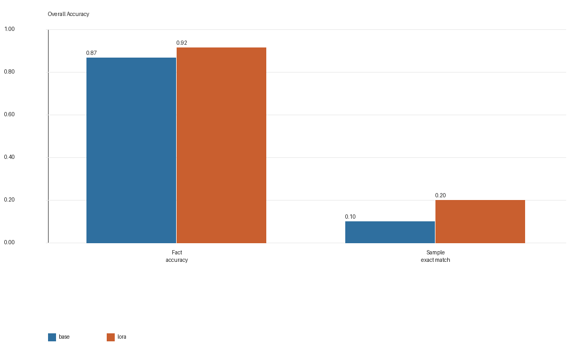
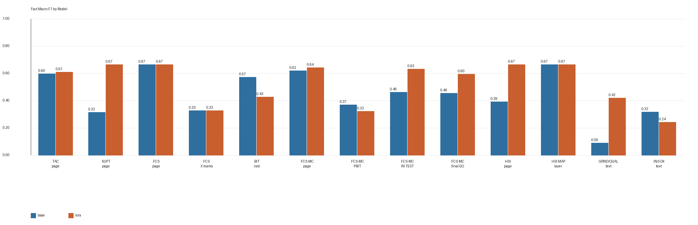
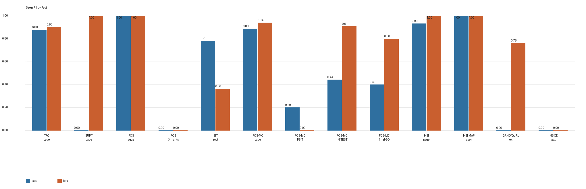
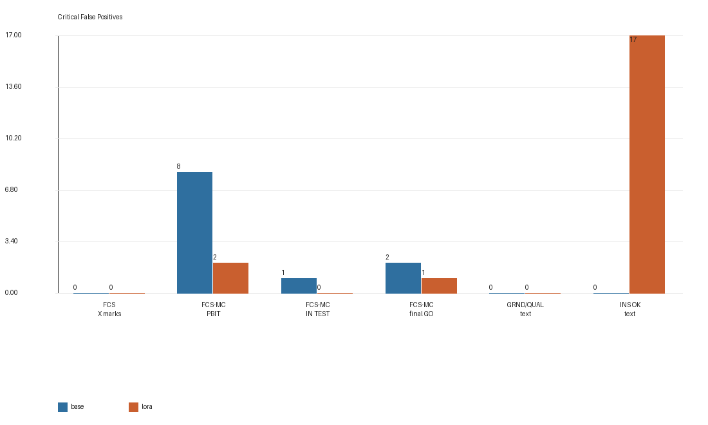
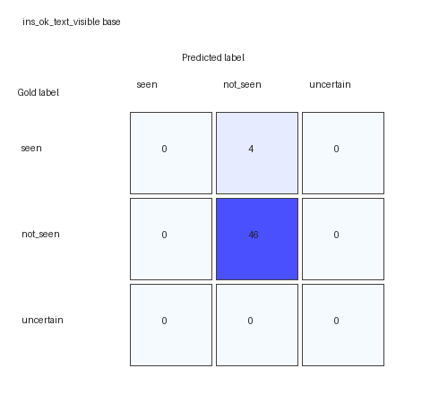
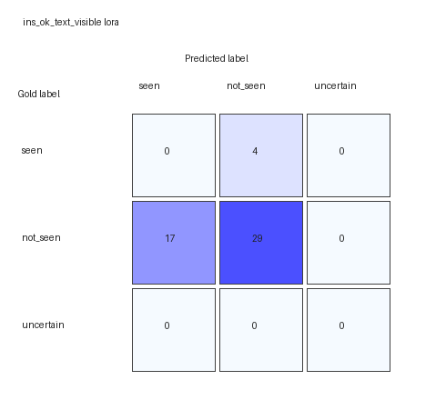
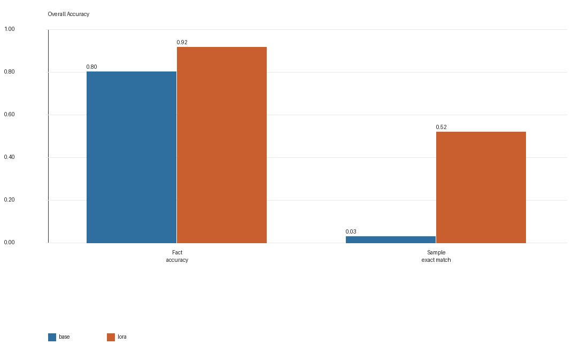
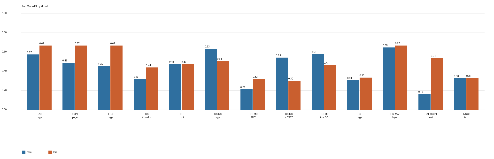
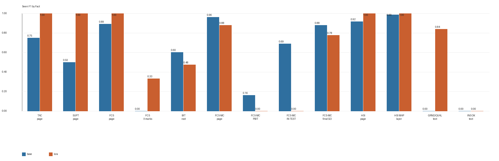
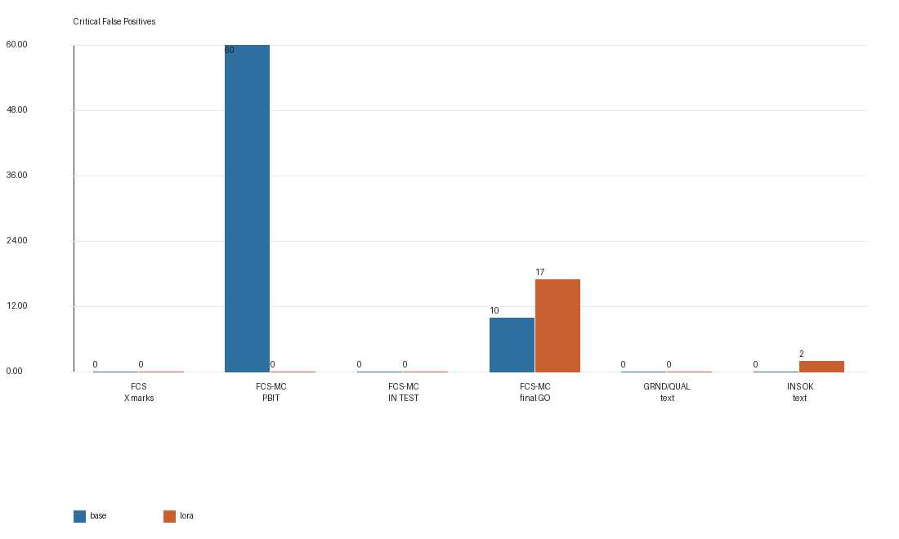

# Run-003 Qwen3.5-9B VLM LoRA Fine-Tuning Report

## Abstract

This report documents the Run-003 visual-fact experiment for SimTutor's F/A-18C cold-start cockpit perception pipeline. The goal is to test whether a redesigned, more directly observable fact ontology and a small human-reviewed dataset can improve structured VLM extraction while reducing dangerous false positives from the earlier `ins_go` target.

The experiment fine-tunes `Qwen/Qwen3.5-9B-Base` with an Unsloth-accelerated PEFT LoRA VLM SFT setup using TRL `SFTTrainer`. The model is trained on 220 human-reviewed Run-003 composite-panel images exported in English and Chinese, producing 440 multimodal SFT rows. Training uses 4-bit LoRA with rank 16, alpha 16, dropout 0.0, four epochs, and a 10% internal eval split.

The main independent evaluation uses Run-002 re-labeled with the new 13-fact ontology. On this 50-sample holdout, LoRA improves fact accuracy from `0.8677` to `0.9154`, seen F1 from `0.5022` to `0.6680`, and sample exact match from `0.10` to `0.20`. The adapter substantially improves FCS-MC and HSI alignment-text recognition, but it introduces a new critical failure mode: `ins_ok_text_visible` false positives increase from 0 to 17. A second Run-004 random stress set shows a stronger reduction in total critical false positives, from 70 to 19, but that set is visually repetitive and should be treated as a stress reference rather than the primary generalization claim.

Overall, Run-003 supports the main hypothesis that small, domain-specific LoRA fine-tuning can improve structured cockpit visual fact extraction. It also shows that clean single-fact boundary data is not sufficient by itself: realistic multi-display fact co-occurrence and targeted hard negatives are needed before the adapter can be used reliably in live cockpit-state reasoning.

## 1. Motivation

The earlier Run-001 LoRA experiment used eight visual facts. It achieved strong gains on Run-001 and Run-002, but the heldout Run-002 benchmark exposed a major issue: `ins_go` produced many false positives. The problem was not only model capacity. `ins_go` compressed a higher-level procedural completion state into a single-frame VLM label, even though the visible evidence could be ambiguous under map overlays, small text, countdown states, and display-transition artifacts.

Run-003 therefore redesigns the fact ontology around lower-level visual observations. Instead of asking the model whether INS is "GO" as a procedural state, the new ontology separates HSI page visibility, MAP layer visibility, GRND/QUAL/TIME alignment text, and OK text. Similarly, the FCS-MC flow is split into page visibility, PBIT/intermediate state, IN TEST state, and final GO result.

The experiment asks three questions:

1. Can the new ontology preserve or improve overall structured extraction accuracy?
2. Does splitting high-level completion targets reduce FCS-MC and INS false positives?
3. What remaining failure modes appear when the model is tested on independent and random cockpit captures?

## 2. Visual Fact Ontology

The input is a single VLM-ready composite-panel image. Its fixed top-to-bottom regions are:

| Region | Meaning |
|---|---|
| `left_ddi` | Left Digital Display Indicator |
| `ampcd` | Advanced Multipurpose Color Display |
| `right_ddi` | Right Digital Display Indicator |

Each visual fact is labeled as:

| State | Meaning |
|---|---|
| `seen` | The fact is clearly visible in the current image |
| `not_seen` | The fact is absent from the current image |
| `uncertain` | The fact is unreadable, partially visible, or cannot be decided from one image |

Run-003 uses 13 core facts:

| fact_id | Meaning |
|---|---|
| `tac_page_visible` | A real TAC/TAC MENU page is visible, not merely a TAC option label |
| `supt_page_visible` | A real SUPT/SUPT MENU page is visible |
| `fcs_page_visible` | The dedicated FCS control page with flight-control layout is visible |
| `fcs_page_x_marks_visible` | Literal X/fault fills are visible inside FCS page boxes |
| `bit_root_page_visible` | The BIT FAILURES/root page is visible |
| `fcsmc_page_visible` | The FCS-MC subpage with MC1/MC2/FCSA/FCSB rows is visible |
| `fcsmc_intermediate_result_visible` | PBIT GO or another pre-final FCS-MC result is visible |
| `fcsmc_in_test_visible` | FCS-MC IN TEST text is visible |
| `fcsmc_final_go_result_visible` | Final GO result rows are visible, especially FCSA and FCSB |
| `hsi_page_visible` | HSI navigation/POS page is visible |
| `hsi_map_layer_visible` | Colored HSI MAP layer is visible |
| `ins_grnd_alignment_text_visible` | GRND/QUAL/TIME alignment text is visible |
| `ins_ok_text_visible` | OK text near the INS alignment block is visible |

This ontology is intentionally more granular than the previous eight facts. The VLM is trained to output visual evidence, not final procedural decisions. Downstream code should combine these facts with procedure context, telemetry, and temporal stability checks.

## 3. Dataset Construction

Run-003 uses a manually guided capture plan designed to cover clean visual boundaries and hard negatives for the new facts. The reviewed dataset contains 220 composite-panel images. Human labels were produced in Label Studio after Qwen 397B pre-labeling. The final SFT export uses OpenAI-compatible multimodal chat JSONL.

The training target intentionally excludes dataset/runtime metadata such as `frame_id`, `source_frame_id`, `confidence`, `expires_after_ms`, and `sticky`. These values are not visually inferable from a single image and should be attached by the runtime system rather than generated by the VLM.

### 3.1 Run-003 Label Distribution

| fact_id | seen | not_seen | uncertain |
|---|---:|---:|---:|
| `tac_page_visible` | 46 | 174 | 0 |
| `supt_page_visible` | 20 | 200 | 0 |
| `fcs_page_visible` | 30 | 190 | 0 |
| `fcs_page_x_marks_visible` | 16 | 204 | 0 |
| `bit_root_page_visible` | 18 | 202 | 0 |
| `fcsmc_page_visible` | 55 | 165 | 0 |
| `fcsmc_intermediate_result_visible` | 18 | 202 | 0 |
| `fcsmc_in_test_visible` | 18 | 202 | 0 |
| `fcsmc_final_go_result_visible` | 18 | 202 | 0 |
| `hsi_page_visible` | 106 | 114 | 0 |
| `hsi_map_layer_visible` | 79 | 141 | 0 |
| `ins_grnd_alignment_text_visible` | 58 | 162 | 0 |
| `ins_ok_text_visible` | 12 | 206 | 2 |

The distribution is intentionally not a natural cockpit-frequency estimate. It is closer to a controlled visual-boundary set. This makes the data efficient for teaching page and state distinctions, but it also creates a potential mismatch with realistic cockpit screenshots where multiple facts are visible at the same time.

### 3.2 SFT Format

Each SFT row contains:

```json
{
  "messages": [
    {"role": "system", "content": "You are SimTutor visual fact extractor. Reply with JSON only."},
    {"role": "user", "content": [{"type": "image_url", "image_url": {"url": "data:image/png;base64,..."}}, {"type": "text", "text": "...13-fact instruction..."}]},
    {"role": "assistant", "content": "{\"facts\":[{\"fact_id\":\"tac_page_visible\",\"state\":\"seen\",\"evidence_note\":\"\"}, ...]}"}
  ]
}
```

The Run-003 export was produced with `--drop-summary` and without evidence notes in the assistant target. This focuses the supervised target on the fact states themselves.

## 4. Fine-Tuning Setup

The training stack is:

```text
Qwen/Qwen3.5-9B-Base
  + Unsloth VLM loading and 4-bit preparation
  + PEFT LoRA adapters
  + TRL SFTTrainer
```

Key training parameters:

| Parameter | Value |
|---|---:|
| training images | 220 |
| SFT rows | 440 |
| internal train rows | 396 |
| internal eval rows | 44 |
| epochs | 4 |
| learning rate | 2e-4 |
| batch size | 1 |
| gradient accumulation | 4 |
| effective batch size | 4 |
| max sequence length | 4096 |
| LoRA rank | 16 |
| LoRA alpha | 16 |
| LoRA dropout | 0.0 |
| seed | 3407 |
| runtime | 3375.8s |
| final train loss | 0.3479 |
| final internal eval loss | 0.0008 |

The internal eval split is drawn from the same Run-003 reviewed data pool and is only a training sanity check. It should not be interpreted as independent generalization.

## 5. Benchmark Method

The benchmark compares the base model and the Run-003 LoRA adapter on reviewed holdout JSONL files. Both models receive the same images and the same 13-fact English benchmark prompt. Outputs are parsed as JSON, normalized, and compared to human labels.

Metrics:

| Metric | Meaning |
|---|---|
| JSON valid rate | Output can be parsed as a JSON object |
| schema valid rate | Output conforms to expected fields |
| fact accuracy | Three-class accuracy over all facts |
| macro F1 | Macro F1 over `seen`, `not_seen`, and `uncertain` |
| seen F1 | Positive-class F1 for `seen` |
| sample exact match | All 13 facts must match for the sample to be correct |
| critical false positives | Critical facts predicted `seen` when gold is `not_seen` or `uncertain` |

Run-003 critical facts are:

```text
fcs_page_x_marks_visible
fcsmc_intermediate_result_visible
fcsmc_in_test_visible
fcsmc_final_go_result_visible
ins_grnd_alignment_text_visible
ins_ok_text_visible
```

## 6. Evaluation Sets

### 6.1 Run-002 New-Facts Holdout

Run-002 is an independently captured session from earlier work, re-labeled under the new 13-fact ontology. It contains 50 samples and is the main independent holdout for Run-003.

| fact_id | seen | not_seen |
|---|---:|---:|
| `tac_page_visible` | 23 | 27 |
| `supt_page_visible` | 5 | 45 |
| `fcs_page_visible` | 13 | 37 |
| `fcs_page_x_marks_visible` | 1 | 49 |
| `bit_root_page_visible` | 9 | 41 |
| `fcsmc_page_visible` | 9 | 41 |
| `fcsmc_intermediate_result_visible` | 1 | 49 |
| `fcsmc_in_test_visible` | 6 | 44 |
| `fcsmc_final_go_result_visible` | 2 | 48 |
| `hsi_page_visible` | 49 | 1 |
| `hsi_map_layer_visible` | 27 | 23 |
| `ins_grnd_alignment_text_visible` | 42 | 8 |
| `ins_ok_text_visible` | 4 | 46 |

### 6.2 Run-004 Random Stress Set

Run-004 is a random-operation holdout with 100 samples. It contains many repeated or skewed states, so it is not used as the primary generalization result. It is useful as a stress reference for random cockpit states.

| fact_id | seen | not_seen |
|---|---:|---:|
| `bit_root_page_visible` | 16 | 84 |
| `fcsmc_page_visible` | 84 | 16 |
| `fcsmc_intermediate_result_visible` | 7 | 93 |
| `fcsmc_in_test_visible` | 17 | 83 |
| `fcsmc_final_go_result_visible` | 60 | 40 |
| `ins_ok_text_visible` | 0 | 100 |

## 7. Results

### 7.1 Run-002 New-Facts Holdout









| Metric | Base | LoRA |
|---|---:|---:|
| JSON valid rate | 1.0000 | 1.0000 |
| schema valid rate | 1.0000 | 1.0000 |
| fact accuracy | 0.8677 | 0.9154 |
| macro F1 | 0.4513 | 0.5306 |
| seen F1 | 0.5022 | 0.6680 |
| sample exact match | 0.1000 | 0.2000 |
| critical false positives | 11 | 20 |

Run-002 shows clear overall improvement. The adapter improves fact accuracy by 4.77 percentage points, seen F1 by 16.57 points, and sample exact match by 10 points. This indicates that the new 13-fact training target is learnable and that the LoRA adapter improves cross-session structured extraction.

However, critical false positives increase. The increase is concentrated in `ins_ok_text_visible`: base has 0 false positives for this fact, while LoRA has 17. This means the old `ins_go` problem has not disappeared entirely; it has moved into the more specific OK-text completion cue.

Important per-fact changes:

| fact | accuracy base -> LoRA | seen F1 base -> LoRA | seen FP base -> LoRA | seen FN base -> LoRA |
|---|---:|---:|---:|---:|
| `supt_page_visible` | 0.90 -> 1.00 | 0.00 -> 1.00 | 0 -> 0 | 5 -> 0 |
| `fcsmc_page_visible` | 0.96 -> 0.98 | 0.89 -> 0.94 | 1 -> 0 | 1 -> 1 |
| `fcsmc_in_test_visible` | 0.90 -> 0.98 | 0.44 -> 0.91 | 1 -> 0 | 4 -> 1 |
| `fcsmc_final_go_result_visible` | 0.94 -> 0.98 | 0.40 -> 0.80 | 2 -> 1 | 1 -> 0 |
| `ins_grnd_alignment_text_visible` | 0.16 -> 0.68 | 0.00 -> 0.76 | 0 -> 0 | 42 -> 16 |
| `ins_ok_text_visible` | 0.92 -> 0.58 | 0.00 -> 0.00 | 0 -> 17 | 4 -> 4 |





### 7.2 Run-004 Random Stress Set









| Metric | Base | LoRA |
|---|---:|---:|
| JSON valid rate | 0.9600 | 1.0000 |
| schema valid rate | 0.9600 | 1.0000 |
| fact accuracy | 0.8038 | 0.9185 |
| macro F1 | 0.4393 | 0.4901 |
| seen F1 | 0.5659 | 0.6390 |
| sample exact match | 0.0300 | 0.5200 |
| critical false positives | 70 | 19 |

Run-004 shows a large reduction in total critical false positives and a large increase in exact match. The largest improvement is the removal of many `fcsmc_intermediate_result_visible` false positives: base produces 60 such false positives, while LoRA produces 0.

At the same time, this stress set exposes recall problems. For example, `bit_root_page_visible` LoRA has 0 false positives but 11 false negatives, reducing seen F1 from 0.60 to 0.48. `fcsmc_page_visible` has 0 false positives but 18 false negatives. This indicates that the adapter became conservative under more complex or repeated cockpit contexts.

The Run-004 result should therefore be interpreted as mixed: LoRA is less noisy and more structured, but some page/state facts lose recall under random multi-display combinations.

## 8. Discussion

### 8.1 What Improved

Run-003 improves the parts of the task that match the new low-level ontology well. On Run-002, FCS-MC page recognition, IN TEST recognition, and final GO recognition all improve. HSI page and map-layer facts are also stable. The model learns the 13-fact JSON contract and produces valid schema-conforming output.

The adapter also reduces several dangerous FCS-MC confusions. On Run-002, FCS-MC intermediate, IN TEST, and final GO critical false positives fall from 11 combined errors in the base model to 3 in the LoRA model. This is important because PBIT GO, IN TEST, and final GO represent different procedural states.

### 8.2 What Failed

The main new failure mode is `ins_ok_text_visible`. On Run-002, LoRA predicts OK text in 17 cases where the human label is `not_seen`. This resembles the earlier `ins_go` issue, but the failure is now localized to a specific low-level text cue. That is an improvement in interpretability but not yet a complete safety solution.

Run-004 also shows that the adapter can become too conservative for some facts. It often avoids false positives, but misses real `bit_root_page_visible`, `fcsmc_page_visible`, `fcsmc_intermediate_result_visible`, and `fcsmc_in_test_visible` positives. This likely reflects data distribution mismatch: Run-003 was designed around clean visual boundary examples, while real cockpit states often contain multiple simultaneously visible facts across the three displays.

### 8.3 Why Run-001 Looked Easier

Run-001 used only eight facts and contained coarser targets. Several targets were page-level or broad state labels. Run-003 has 13 facts and includes small-text distinctions such as PBIT GO, IN TEST, final GO, GRND/QUAL/TIME, and OK. These labels are harder, rarer, and more sensitive to hard-negative coverage.

The new task is therefore more informative but also more demanding. A lower score on a fine-grained fact does not mean the ontology is worse. It may mean the metric now exposes a failure mode that was previously hidden inside a coarser label.

### 8.4 Prompt and Runtime Integration Caveat

The benchmark prompt and the SFT prompt are aligned around the new 13 facts. The current live runtime prompt and `vision_facts.yaml` still contain older facts such as `ins_go`, `fcs_bit_result_visible`, and display-specific FCS-MC facts. This does not invalidate the Run-003 benchmark, but it means the Run-003 adapter should not be dropped into the live system without synchronizing the runtime fact schema, output contract, and decision boundaries.

In particular, the VLM should not be asked to generate `source_frame_id` or `confidence`; these are runtime metadata or unreliable self-reports. The runtime should attach frame identifiers after parsing.

## 9. Limitations

The main limitations are:

- Run-003 has only 220 unique images; bilingual export improves instruction diversity but not visual diversity.
- Several critical facts have very few positive examples, such as `ins_ok_text_visible` with 12 seen labels.
- The Run-003 capture plan emphasizes clean fact boundaries and may underrepresent realistic multi-display co-occurrence.
- Run-004 is useful as a stress set but is visually skewed and repetitive.
- The internal eval loss is not an independent generalization metric.
- Live runtime prompt/schema migration is still pending.

## 10. Next Steps

The facts should remain frozen for the next iteration to preserve comparability. The next step is add a Run-005 composition dataset:

| Category | Purpose |
|---|---|
| TAC + HSI MAP + BIT root | Teach default cold-start multi-fact co-occurrence |
| SUPT + HSI MAP + BIT root | Improve page recall under navigation context |
| FCS page + HSI + BIT root | Teach FCS and BIT root co-occurrence |
| FCS-MC PBIT + HSI/TAC/SUPT | Distinguish PBIT GO from final GO |
| FCS-MC IN TEST + HSI | Improve IN TEST recall |
| FCS-MC final GO + INS no OK | Decouple FCS completion from INS completion |
| HSI GRND/QUAL/TIME without OK | Reduce `ins_ok_text_visible` false positives |
| Mixed non-target pages | Reduce false positives under random navigation |

Training should start again from the base model using Run-003 plus Run-005, rather than continuing from the Run-003 adapter. This yields a cleaner experimental comparison and avoids conflating continuation effects with data-distribution effects.

## 11. Conclusion

Run-003 is a successful ontology and fine-tuning iteration, but not a final deployment solution. It demonstrates that a 9B VLM can be adapted with a small human-reviewed dataset to produce structured cockpit visual facts under a more precise 13-fact schema. The adapter improves overall extraction on the independent Run-002 new-facts holdout and reduces many FCS-MC confusions.

The remaining problem is not simply model size. It is the combination of rare positive examples, completion-text ambiguity, and a gap between clean training captures and realistic multi-display cockpit compositions. The next experiment should therefore add targeted composition and hard-negative data while keeping the 13-fact ontology fixed.

