# Run-005 Composition-Rebalance Qwen3.5-9B VLM LoRA Fine-Tuning Report

## Abstract

This report documents the Run-005 composition-rebalance data collection and the subsequent LoRA fine-tuning round for SimTutor's F/A-18C cockpit visual fact extractor. Compared with Run-003, this round does not change the ontology. It keeps the current 13 visual facts fixed and focuses on data distribution, including multi-display co-occurrence, targeted hard negatives, small-text state positives, and moderate oversampling of the Run-005 supplement.

The model is still `Qwen/Qwen3.5-9B-Base`, trained with an Unsloth-accelerated PEFT LoRA VLM SFT setup using TRL `SFTTrainer`. The training corpus combines Run-003 and Run-005: Run-003 contributes 220 human-reviewed images, and Run-005 contributes 122 composition-rebalance images. After bilingual export, the final training input contains 928 rows because the bilingual Run-005 set is repeated once more to give that supplement more weight during training.

On the stronger external benchmark `Run-002 newfacts holdout`, the new adapter improves fact accuracy from `0.8677` to `0.9908`, seen F1 from `0.5022` to `0.9648`, sample exact match from `0.10` to `0.88`, and critical false positives from `11` down to `4`. On `Run-004 random holdout` with 100 samples, it likewise clearly outperforms both the base model and the earlier Run-003 adapter: fact accuracy improves from `0.8038` to `0.9931`, seen F1 from `0.5659` to `0.9159`, sample exact match from `0.03` to `0.92`, and critical false positives drop from `70` to `8`.

It should also be noted that Run-004 has no exact image overlap with training, but its positive support is uneven. Several near-`1.0` seen-F1 values are therefore based on very small positive counts and should be read together with support size. Taken together, the two holdouts indicate that, with the 13-fact ontology held constant, composition-balanced supplemental data and moderate oversampling can substantially improve structured cockpit visual fact extraction under multi-display co-occurrence, while Run-002 remains the stronger source of external generalization evidence.

## 1. Background and Motivation

### 1.1 From Run-001 to Run-003

The system input is not three separate screenshots. It is a single composite-panel artifact with a fixed top-to-bottom layout:

| Region | Meaning |
|---|---|
| `left_ddi` | Left DDI |
| `ampcd` | AMPCD |
| `right_ddi` | Right DDI |

Run-001 used 8 relatively coarse facts. It established that a small amount of reviewed domain data can strongly improve structured cockpit extraction, but it also exposed the weakness of high-level targets such as `ins_go`. Single-frame images are a poor basis for directly predicting procedural completion, especially when map overlays, small text, intermediate states, and page transitions are present.

Run-003 addressed that problem by replacing the older targets with a lower-level 13-fact ontology. For example:

- INS reasoning was decomposed into `hsi_page_visible`, `hsi_map_layer_visible`, `ins_grnd_alignment_text_visible`, and `ins_ok_text_visible`.
- FCS-MC reasoning was decomposed into `fcsmc_page_visible`, `fcsmc_intermediate_result_visible`, `fcsmc_in_test_visible`, and `fcsmc_final_go_result_visible`.

Run-003 already showed that this ontology is learnable. On `Run-002 newfacts holdout`, fact accuracy improved from `0.8677` to `0.9154`, and seen F1 improved from `0.5022` to `0.6680`. However, two new signals also appeared:

1. `ins_ok_text_visible` produced many false positives, meaning that the old `ins_go` risk did not disappear completely; it moved into a more specific visual completion cue.
2. On `Run-004 random holdout`, the Run-003 adapter still looked conservative on `bit_root_page_visible`, `fcsmc_page_visible`, `fcsmc_intermediate_result_visible`, and `fcsmc_in_test_visible`, suggesting a remaining mismatch between the training set and realistic multi-display cockpit composition.

### 1.2 Why the ontology is kept fixed in this round

This round keeps the 13-fact ontology unchanged in order to isolate the main remaining variable. After Run-003, two points were already clear:

- the ontology is trainable, interpretable, and operationally controllable;
- the larger remaining problem appears to be data distribution rather than label definition.

Run-005 therefore addresses the following question:

> If the 13 facts stay fixed, can better multi-display composition data and better hard negatives substantially improve the adapter?

## 2. The Current Fixed 13-Fact Ontology

This round continues to use the same 13 core facts introduced in Run-003:

| fact_id | Meaning |
|---|---|
| `tac_page_visible` | The actual TAC/TAC MENU page is visible, not merely a TAC pushbutton label |
| `supt_page_visible` | The actual SUPT/SUPT MENU page is visible |
| `fcs_page_visible` | The dedicated FCS page is visible |
| `fcs_page_x_marks_visible` | Literal X/fault fills are visible in FCS channel boxes |
| `bit_root_page_visible` | The BIT FAILURES/root page is visible |
| `fcsmc_page_visible` | The FCS-MC subpage is visible with readable MC1/MC2/FCSA/FCSB rows |
| `fcsmc_intermediate_result_visible` | PBIT GO or another intermediate result is visible, but not final GO |
| `fcsmc_in_test_visible` | IN TEST is visible |
| `fcsmc_final_go_result_visible` | Final GO is visible on the FCS-MC page |
| `hsi_page_visible` | The HSI/POS page is visible |
| `hsi_map_layer_visible` | The colored MAP layer is visible |
| `ins_grnd_alignment_text_visible` | The GRND/QUAL/TIME alignment block is visible |
| `ins_ok_text_visible` | A clearly readable OK is visible near the alignment block |

Each fact still uses three labels:

| state | Meaning |
|---|---|
| `seen` | The fact is clearly present in the current image |
| `not_seen` | The fact is absent from the current image |
| `uncertain` | One frame is insufficient because the content is unreadable, blurred, obstructed, or transitional |

The downstream system still consumes structured fact states rather than model summaries. Accordingly, this training export again uses `--drop-summary`, and assistant targets exclude non-visual metadata such as `confidence` and `source_frame_id`.

## 3. Why Run-005 Composition Rebalance Was Needed

The main weakness of Run-003 was not only that some facts had too few positives. More importantly, Run-003 behaved like a clean boundary dataset: it taught single-fact distinctions well, but it underrepresented realistic multi-display co-occurrence. Common cold-start compositions include:

- TAC or SUPT on the left, HSI on the AMPCD, and BIT root on the right;
- HSI GRND/QUAL/TIME co-occurring with `PBIT GO`, `IN TEST`, or `final GO` on FCS-MC;
- `FCS-MC final GO` combined with `INS OK not seen`, which is exactly the hard-negative case needed to avoid unsafe completion hallucinations;
- purely non-target pages, stable blank screens, and blurred transition states.

Run-005 was therefore designed as a supplemental dataset rather than a replacement for Run-003. Its main goals were:

1. add more positives and realistic co-occurrence for `bit_root_page_visible`, `fcs_page_visible`, and `fcsmc_page_visible`;
2. add more small-text positives for `PBIT GO`, `IN TEST`, and `final GO`;
3. add hard negatives such as `FCS-MC final GO + HSI no OK`;
4. retain enough non-target, blank, and transition cases to discourage over-reporting.

## 4. Dataset Construction and Distribution Design

### 4.1 Run-003 and Run-005 scale

| Dataset | reviewed images | SFT rows (EN+ZH) | Role |
|---|---:|---:|---|
| Run-003 | 220 | 440 | original 13-fact main training set |
| Run-005 composition rebalance | 122 | 244 | multi-display co-occurrence and hard-negative supplement |

Run-005 export statistics are:

| fact_id | seen | not_seen | uncertain |
|---|---:|---:|---:|
| `tac_page_visible` | 24 | 98 | 0 |
| `supt_page_visible` | 34 | 88 | 0 |
| `fcs_page_visible` | 40 | 79 | 3 |
| `fcs_page_x_marks_visible` | 18 | 104 | 0 |
| `bit_root_page_visible` | 43 | 78 | 1 |
| `fcsmc_page_visible` | 56 | 65 | 1 |
| `fcsmc_intermediate_result_visible` | 15 | 107 | 0 |
| `fcsmc_in_test_visible` | 19 | 103 | 0 |
| `fcsmc_final_go_result_visible` | 22 | 100 | 0 |
| `hsi_page_visible` | 109 | 13 | 0 |
| `hsi_map_layer_visible` | 37 | 85 | 0 |
| `ins_grnd_alignment_text_visible` | 72 | 48 | 2 |
| `ins_ok_text_visible` | 14 | 106 | 2 |

### 4.2 Why Run-005 is oversampled once

Training does not simply concatenate Run-003 and Run-005. Instead, it uses:

```text
Run-003 bilingual once
+ Run-005 bilingual twice
```

In other words, the Run-005 EN/ZH set is repeated once more during training. The purpose is not to imitate natural cockpit frequencies. The purpose is to give sufficient weight to the newly collected composition-balanced examples so that the model more reliably learns:

- multi-display co-occurrence;
- small-text state cues;
- the separation between final GO and INS OK;
- the difference between non-target, unreadable, and truly visible states.

The resulting weighted training fact distribution is:

| fact_id | seen | not_seen | uncertain |
|---|---:|---:|---:|
| `tac_page_visible` | 94 | 370 | 0 |
| `supt_page_visible` | 88 | 376 | 0 |
| `fcs_page_visible` | 110 | 348 | 6 |
| `fcs_page_x_marks_visible` | 52 | 412 | 0 |
| `bit_root_page_visible` | 104 | 358 | 2 |
| `fcsmc_page_visible` | 167 | 295 | 2 |
| `fcsmc_intermediate_result_visible` | 48 | 416 | 0 |
| `fcsmc_in_test_visible` | 56 | 408 | 0 |
| `fcsmc_final_go_result_visible` | 62 | 402 | 0 |
| `hsi_page_visible` | 324 | 140 | 0 |
| `hsi_map_layer_visible` | 153 | 311 | 0 |
| `ins_grnd_alignment_text_visible` | 202 | 258 | 4 |
| `ins_ok_text_visible` | 40 | 418 | 6 |

`not_seen` still dominates many facts. That is normal for a multi-label visual fact task because one image cannot contain every fact at once. The design target is therefore not strict 50/50 balancing per fact, but adequate positive support, realistic co-occurrence, and useful hard negatives.

## 5. Fine-Tuning Setup

### 5.1 Why training restarts from the base model

This round does not continue from the Run-003 adapter. It restarts from `Qwen/Qwen3.5-9B-Base`. The reasons are:

1. it makes the performance gain easier to attribute to data distribution repair rather than continued adapter accumulation;
2. it makes `base -> Run-003 -> Run-003+Run-005x2` a cleaner experimental sequence.

### 5.2 Training stack and hyperparameters

The training stack is unchanged:

```text
Qwen/Qwen3.5-9B-Base
  + Unsloth VLM loading and 4-bit preparation
  + PEFT LoRA adapters
  + TRL SFTTrainer
```

Key settings are:

| Parameter | Value |
|---|---:|
| unique reviewed images | 342 |
| weighted bilingual SFT rows | 928 |
| eval rows | 0 |
| epochs | 4 |
| learning rate | 2e-4 |
| per-device batch size | 1 |
| gradient accumulation | 4 |
| effective batch size | 4 |
| max sequence length | 4096 |
| LoRA rank | 16 |
| LoRA alpha | 16 |
| LoRA dropout | 0.0 |
| seed | 3407 |
| train runtime | 6419.16 s |
| train steps per second | 0.145 |
| final train loss | 0.2156 |

`eval_ratio` is set to `0` in this round. This is intentional. Since Run-005 samples are already repeated in training, a same-pool internal eval would be even less informative than usual. This round therefore relies on external holdout benchmark results for generalization claims.

## 6. Evaluation Setup

### 6.1 Run-002 Newfacts Holdout

`Run-002 newfacts` is the stronger external holdout in this report. It comes from an independently captured earlier session and was re-labeled under the current 13-fact ontology. The current checks show:

| Item | Value |
|---|---:|
| sample count | 50 |
| unique images | 50 |
| exact overlap with Run-003 + Run-005 train union | 0 |

Its support distribution is:

| fact_id | seen | not_seen |
|---|---:|---:|
| `tac_page_visible` | 23 | 27 |
| `supt_page_visible` | 5 | 45 |
| `fcs_page_visible` | 13 | 37 |
| `fcs_page_x_marks_visible` | 1 | 49 |
| `bit_root_page_visible` | 9 | 41 |
| `fcsmc_page_visible` | 9 | 41 |
| `fcsmc_intermediate_result_visible` | 1 | 49 |
| `fcsmc_in_test_visible` | 6 | 44 |
| `fcsmc_final_go_result_visible` | 2 | 48 |
| `hsi_page_visible` | 49 | 1 |
| `hsi_map_layer_visible` | 27 | 23 |
| `ins_grnd_alignment_text_visible` | 42 | 8 |
| `ins_ok_text_visible` | 4 | 46 |

Compared with Run-004, this set is smaller, but it is a more informative external test for `ins_ok_text_visible`, `bit_root_page_visible`, and the `fcsmc_*` facts because it contains more meaningful positive support for those categories.

### 6.2 Run-004 Random Holdout

`Run-004 random holdout` is also fully completed and collected locally:

| Item | Value |
|---|---:|
| sample count | 100 |
| unique images | 100 |
| exact overlap with Run-003 + Run-005 train union | 0 |

### 6.3 Run-004 support distribution

Run-004 has an uneven support distribution, which directly affects how the per-fact seen-F1 chart should be interpreted:

| fact_id | seen | not_seen |
|---|---:|---:|
| `tac_page_visible` | 3 | 97 |
| `supt_page_visible` | 3 | 97 |
| `fcs_page_visible` | 94 | 6 |
| `fcs_page_x_marks_visible` | 5 | 95 |
| `bit_root_page_visible` | 16 | 84 |
| `fcsmc_page_visible` | 84 | 16 |
| `fcsmc_intermediate_result_visible` | 7 | 93 |
| `fcsmc_in_test_visible` | 17 | 83 |
| `fcsmc_final_go_result_visible` | 60 | 40 |
| `hsi_page_visible` | 100 | 0 |
| `hsi_map_layer_visible` | 50 | 50 |
| `ins_grnd_alignment_text_visible` | 69 | 31 |
| `ins_ok_text_visible` | 0 | 100 |

This means:

- `tac_page_visible=1.0` is based on only 3 positive examples;
- `fcsmc_intermediate_result_visible=1.0` is based on 7 positives;
- `ins_ok_text_visible` has no positive support in this holdout, so its seen F1 cannot evaluate positive detection quality.

## 7. Results

### 7.1 Run-002 Newfacts Holdout

| Model | JSON valid | schema valid | fact accuracy | macro F1 | seen F1 | sample exact match | critical FP |
|---|---:|---:|---:|---:|---:|---:|---:|
| base | 1.0000 | 1.0000 | 0.8677 | 0.4513 | 0.5022 | 0.1000 | 11 |
| Run-003 LoRA | 1.0000 | 1.0000 | 0.9154 | 0.5306 | 0.6680 | 0.2000 | 20 |
| Run-003 + Run-005x2 LoRA | 1.0000 | 1.0000 | 0.9908 | 0.6515 | 0.9648 | 0.8800 | 4 |

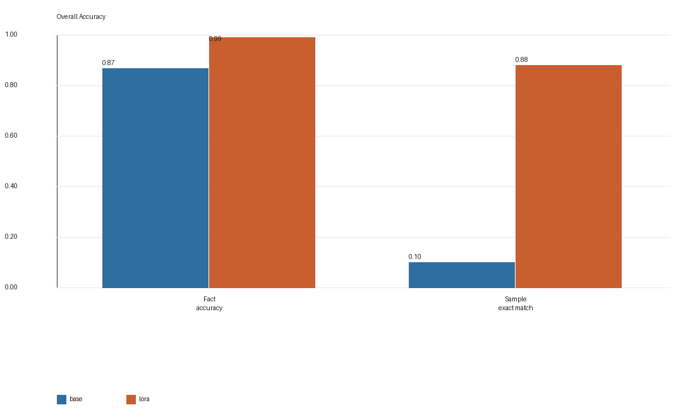

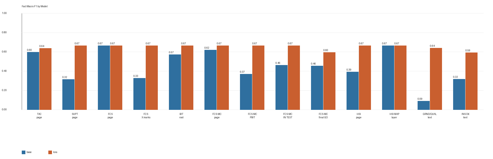

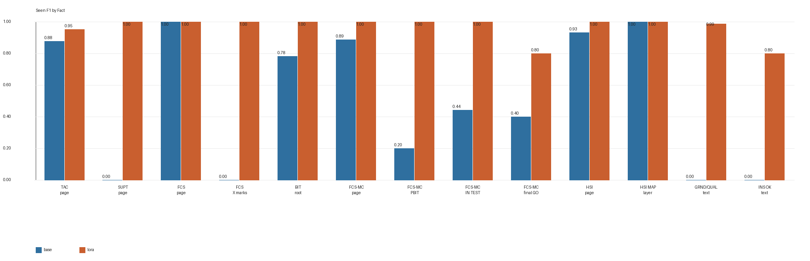

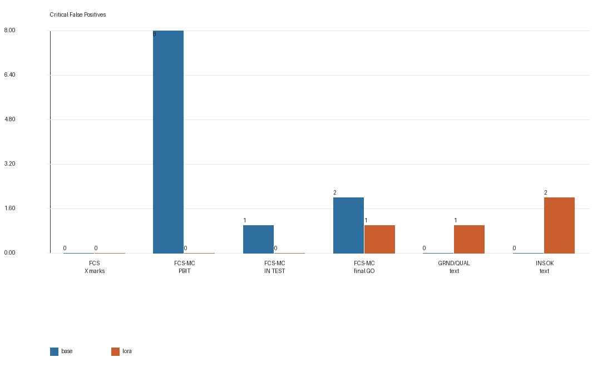

Relative to the base model, the new adapter improves:

- fact accuracy by `+0.1231`
- macro F1 by `+0.2002`
- seen F1 by `+0.4626`
- sample exact match by `+0.78`
- critical false positives by `-7`

Relative to the old Run-003 adapter, the new adapter improves:

- fact accuracy by `+0.0754`
- macro F1 by `+0.1208`
- seen F1 by `+0.2969`
- sample exact match by `+0.68`
- critical false positives by `-16`

For the key facts below, the gain is not simply the result of a more conservative decision boundary. On this stronger external holdout, recall improves while unsafe false positives also decrease:

| fact_id | Run-003 seen F1 | new adapter seen F1 | Run-003 FP/FN | new adapter FP/FN |
|---|---:|---:|---:|---:|
| `bit_root_page_visible` | 0.3636 | 1.0000 | 0 / 7 | 0 / 0 |
| `fcsmc_page_visible` | 0.9412 | 1.0000 | 0 / 1 | 0 / 0 |
| `fcsmc_intermediate_result_visible` | 0.0000 | 1.0000 | 2 / 1 | 0 / 0 |
| `fcsmc_in_test_visible` | 0.9091 | 1.0000 | 0 / 1 | 0 / 0 |
| `fcsmc_final_go_result_visible` | 0.8000 | 0.8000 | 1 / 0 | 1 / 0 |
| `ins_grnd_alignment_text_visible` | 0.7647 | 0.9882 | 0 / 16 | 1 / 0 |
| `ins_ok_text_visible` | 0.0000 | 0.8000 | 17 / 4 | 2 / 0 |

This indicates that Run-005 does not only improve `bit_root` and `FCS-MC` recall. It also substantially reduces the `ins_ok_text_visible` over-reporting pattern observed in Run-003.

Key confusion matrices on Run-002 are:

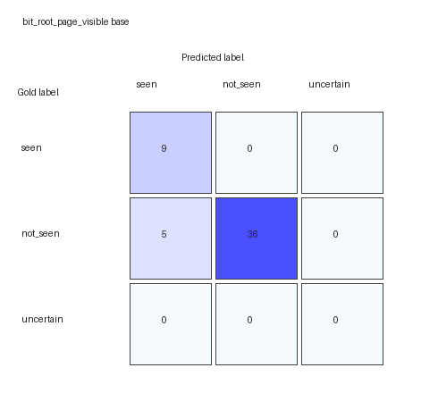

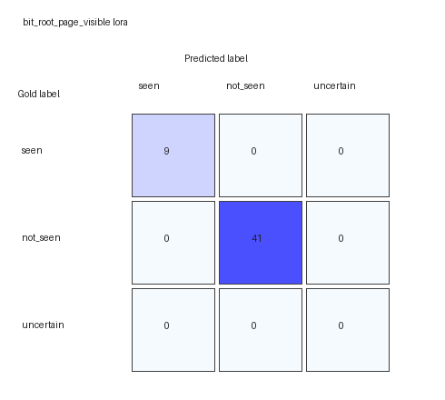

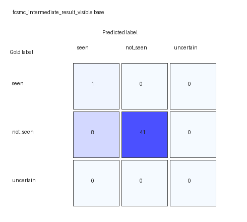

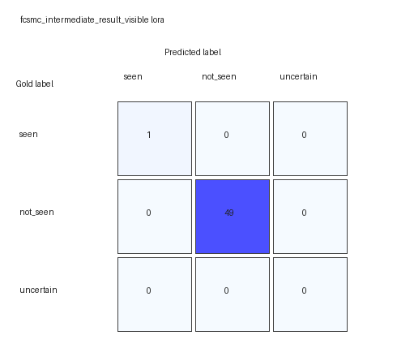


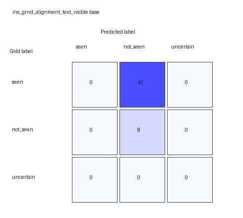

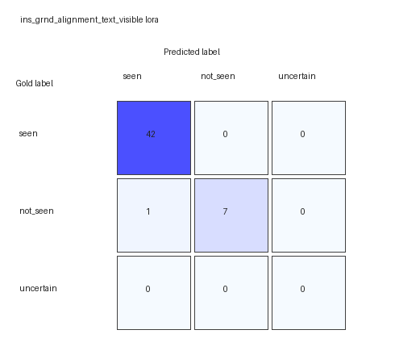


### 7.2 Run-004 Random Holdout

| Model | JSON valid | schema valid | fact accuracy | macro F1 | seen F1 | sample exact match | critical FP |
|---|---:|---:|---:|---:|---:|---:|---:|
| base | 0.9600 | 0.9600 | 0.8038 | 0.4393 | 0.5659 | 0.0300 | 70 |
| Run-003 LoRA | 1.0000 | 1.0000 | 0.9185 | 0.4901 | 0.6390 | 0.5200 | 19 |
| Run-003 + Run-005x2 LoRA | 1.0000 | 1.0000 | 0.9931 | 0.6100 | 0.9159 | 0.9200 | 8 |

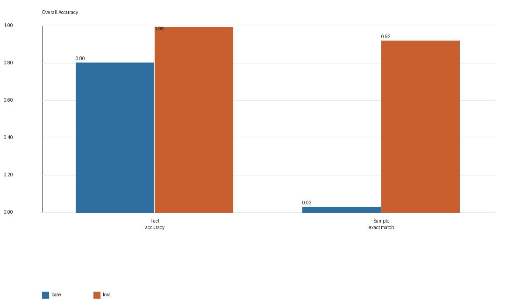

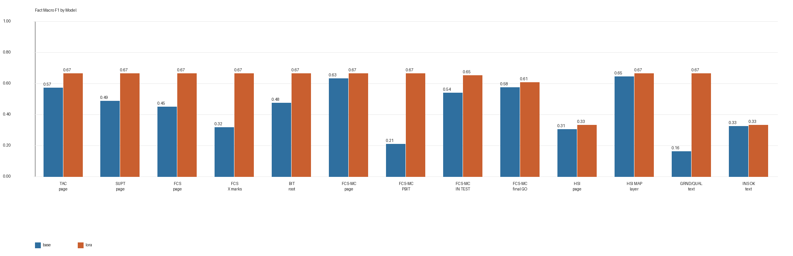

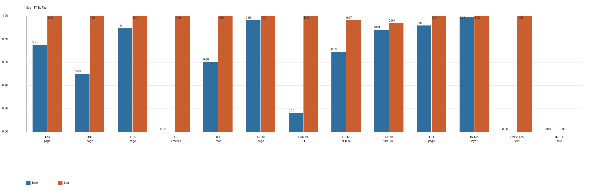

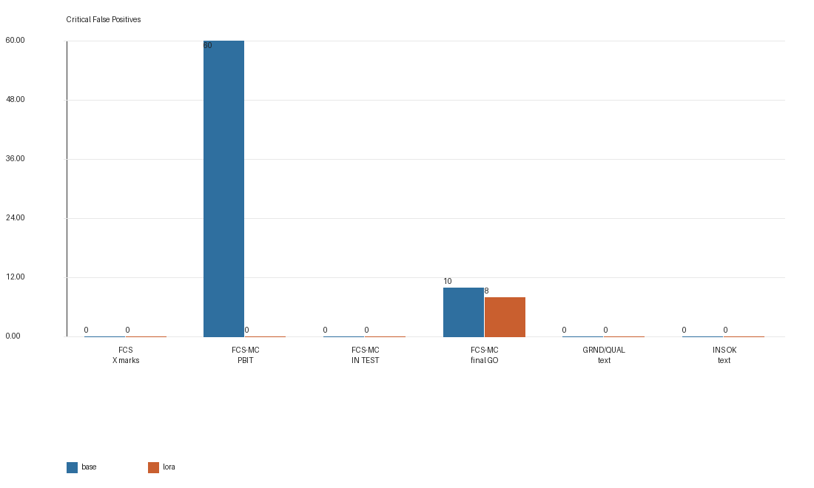

Relative to the base model, the new adapter improves:

- fact accuracy by `+0.1892`
- macro F1 by `+0.1707`
- seen F1 by `+0.3500`
- sample exact match by `+0.89`
- critical false positives by `-62`

Relative to the old Run-003 adapter, the new adapter improves:

- fact accuracy by `+0.0746`
- macro F1 by `+0.1199`
- seen F1 by `+0.2769`
- sample exact match by `+0.40`
- critical false positives by `-11`

### 7.3 Key fact changes on Run-004

The clearest improvements are concentrated in the facts that Run-005 was designed to reinforce:

| fact_id | Run-003 seen F1 | Run-003+Run-005x2 seen F1 | Run-003 FP/FN | new adapter FP/FN |
|---|---:|---:|---:|---:|
| `fcs_page_x_marks_visible` | 0.3333 | 1.0000 | 0 / 4 | 0 / 0 |
| `bit_root_page_visible` | 0.4762 | 1.0000 | 0 / 11 | 0 / 0 |
| `fcsmc_page_visible` | 0.8800 | 1.0000 | 0 / 18 | 0 / 0 |
| `fcsmc_intermediate_result_visible` | 0.0000 | 1.0000 | 0 / 7 | 0 / 0 |
| `fcsmc_in_test_visible` | 0.0000 | 0.9697 | 0 / 17 | 0 / 1 |
| `fcsmc_final_go_result_visible` | 0.7778 | 0.9375 | 17 / 11 | 8 / 0 |
| `ins_grnd_alignment_text_visible` | 0.8403 | 1.0000 | 0 / 19 | 0 / 0 |

In practice, Run-005 mainly improves two error patterns:

1. **missed detections**, especially for `bit_root_page_visible`, `fcsmc_intermediate_result_visible`, and `fcsmc_in_test_visible`;
2. **stage confusion**, especially between `PBIT GO`, `IN TEST`, and `final GO`.

### 7.4 Example confusion matrices on Run-004

`bit_root_page_visible`, base vs new adapter:

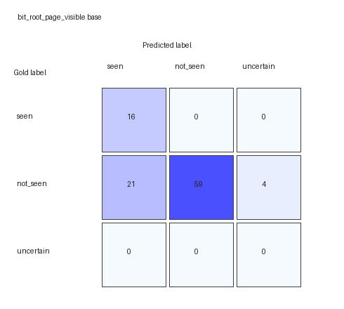


`fcsmc_intermediate_result_visible`, base vs new adapter:

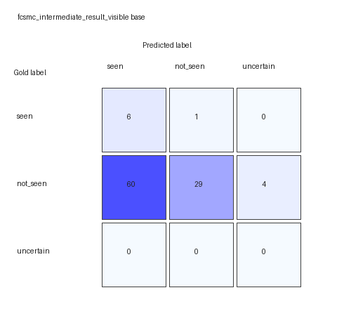


`fcsmc_final_go_result_visible`, base vs new adapter:

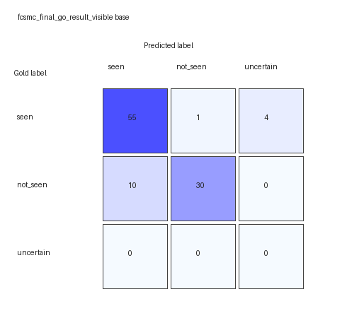


`ins_grnd_alignment_text_visible`, base vs new adapter:

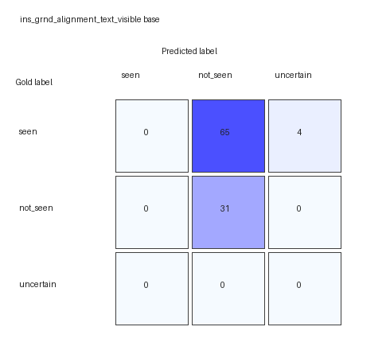

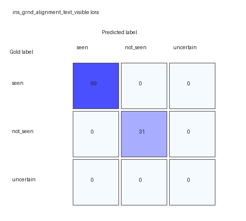

## 8. Interpretation

### 8.1 Why the improvement is unlikely to be a simple artifact

Because the gain in this round is large, the first step is to check for data leakage or benchmark bias. The current evidence argues against that:

1. both Run-002 and Run-004 have exact-overlap `0` against the Run-003 + Run-005 training union;
2. Run-002 and Run-004 also have no internal exact duplicates in the benchmark set itself;
3. the gains are not limited to low-support facts; on the stronger Run-002 holdout, `bit_root_page_visible`, `fcsmc_intermediate_result_visible`, `ins_grnd_alignment_text_visible`, and `ins_ok_text_visible` all improve substantially.

The more plausible explanation is that:

- Run-005 directly targets the main weakness of Run-003;
- oversampling gives the supplemental composition-balanced data enough influence during training.

### 8.2 Why the seen-F1 chart looks unusually high

The per-fact seen-F1 chart is easy to over-read. The main reason is not that the model is suddenly perfect, but that Run-004 support is skewed:

- `tac_page_visible` has only 3 positives;
- `supt_page_visible` has only 3 positives;
- `fcsmc_intermediate_result_visible` has only 7 positives;
- `ins_ok_text_visible` has no positives at all.

For this reason, the Run-004 chart should always be read together with support counts rather than in isolation. By contrast, although Run-002 is smaller, it is the stronger external evidence for this round because it provides more informative positives for `ins_ok_text_visible`, `bit_root_page_visible`, and the `fcsmc_*` facts.

### 8.3 The main remaining problem

The remaining error profile is now much smaller but not yet empty:

- on Run-002, the remaining 4 critical false positives are distributed across `fcsmc_final_go_result_visible` (1), `ins_grnd_alignment_text_visible` (1), and `ins_ok_text_visible` (2);
- on Run-004, all 8 remaining critical false positives concentrate in `fcsmc_final_go_result_visible`.

Overall, the new adapter now separates `bit_root`, `PBIT GO`, `IN TEST`, and `GRND/QUAL/TIME` much more reliably, but it still retains some over-eagerness on completion-style cues, especially final GO.

## 9. Limitations

This report should be read with the following limits in mind:

1. Run-002 and Run-004 both have no exact overlap with training, but their total size is still limited, especially Run-002 with only 50 samples;
2. Run-004 support is visibly skewed, so it is better treated as a random stress set than as the sole basis for the generalization claim;
3. Run-002 now includes positive `ins_ok_text_visible` cases, but support for this fact is still small, so more independent positives are still needed;
4. this round tests whether fixed ontology plus data repair improves performance, not whether the ontology is final;
5. these are offline benchmark results, not the full live SimTutor decision chain.

## 10. Conclusion

This round shows that, without changing the facts again, a combination of more representative multi-display compositions, targeted hard negatives, and moderate oversampling can make the 13-fact VLM substantially more stable.

Compared with the base model, `Run-003 + Run-005x2` improves clearly on both `Run-002 newfacts` and `Run-004 random`. Compared with the older Run-003 adapter, it also shows a consistent second-stage gain. The strongest improvements are aligned with the purpose of Run-005, including `bit_root`, `FCS-MC intermediate`, `IN TEST`, `GRND/QUAL/TIME`, and `INS OK`, which were previously among the most error-prone facts.

Taken together, the current results support keeping the 13-fact ontology stable for now. The next priority is better composition coverage, more independent positive support, and validation inside the full SimTutor downstream reasoning chain rather than another immediate ontology rewrite. Further fully fresh holdout sessions are still needed, especially for rare but high-risk completion cues such as `INS OK` and `final GO`.
