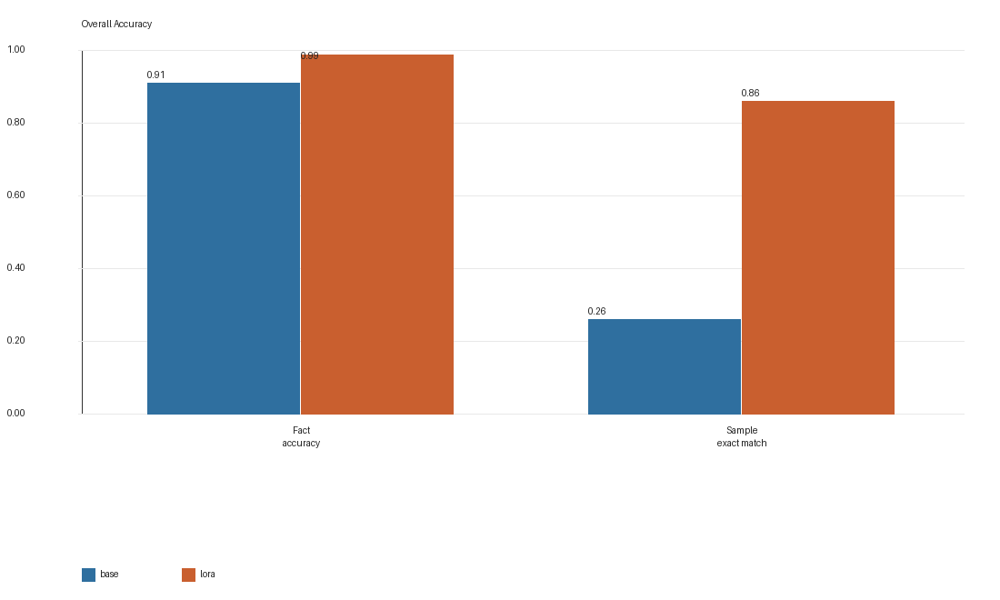
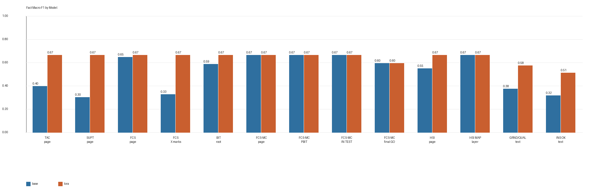
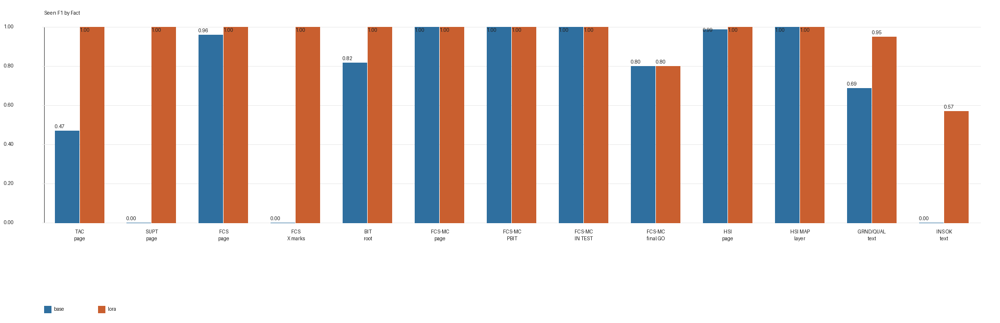
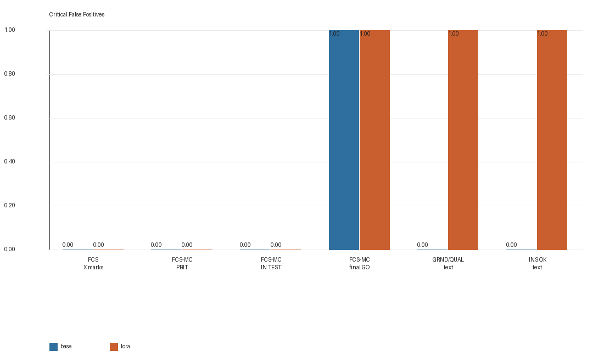
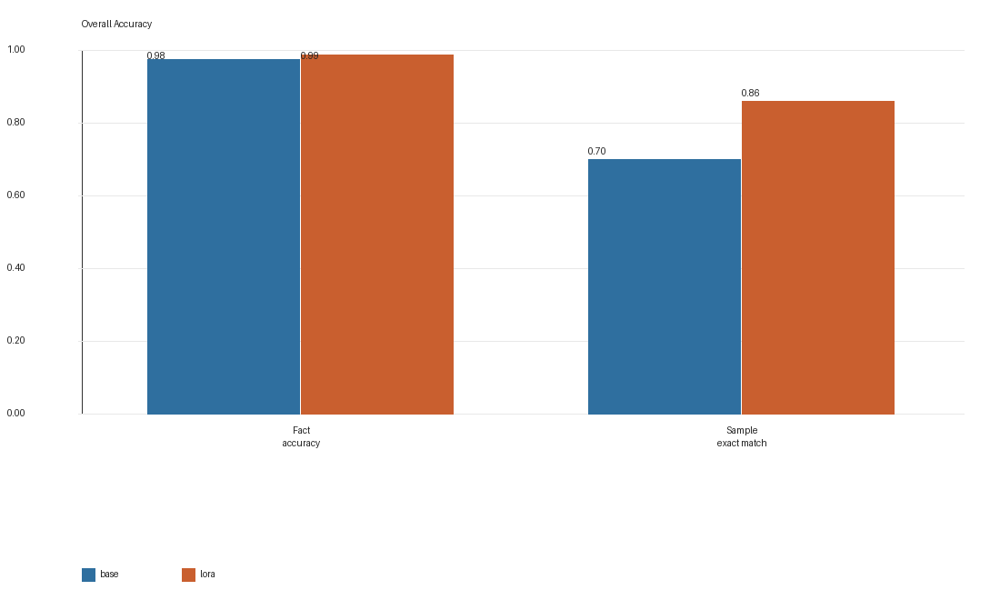
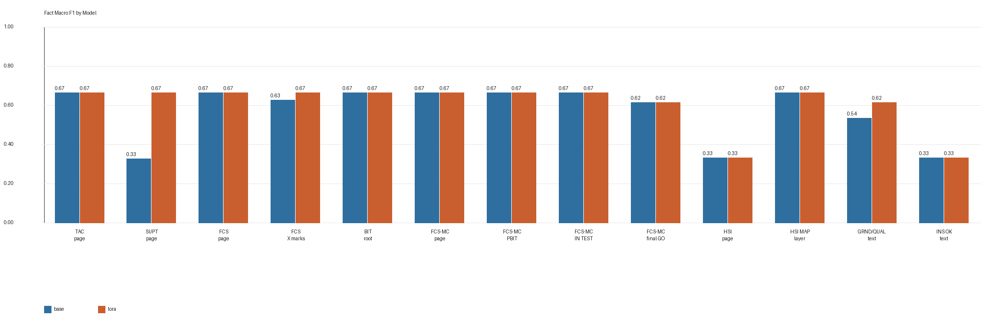
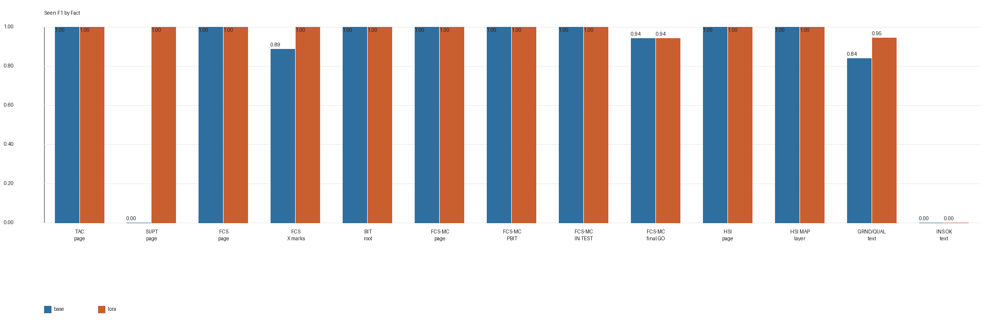
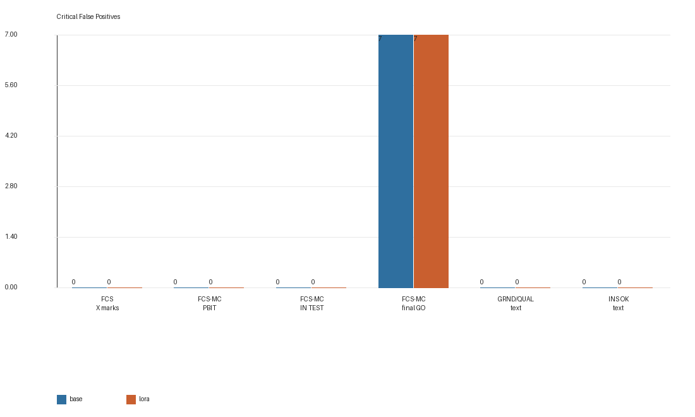

# Qwen3.6-27B VLM Run-003 + Run-005x2 LoRA 微调实验报告

## 摘要

本报告记录在固定 13-fact ontology、固定 `Run-003 + Run-005x2` 数据配方不变的前提下，将视觉基座从 `Qwen/Qwen3.5-9B-Base` 切换到官方 `Qwen/Qwen3.6-27B` 后的一轮 VLM LoRA 微调与 holdout benchmark。

本轮目标不是继续改 facts，也不是扩新数据，而是回答两个更实际的问题：

1. 更强的官方 `Qwen/Qwen3.6-27B` 基座，在相同训练配方下是否还能从 LoRA 中获得稳定收益？
2. 这条线是否能避免 Gemma4 那种“能训练但不能 vLLM 挂 LoRA 推理”的部署尴尬？

训练继续复用当前最佳数据配方：`Run-003 bilingual once + Run-005 composition-rebalance bilingual twice`，总训练输入 928 行，训练 4 个 epoch。训练在 cloud-247 的 `1x H100 94GB` 上完成，使用官方 `Qwen/Qwen3.6-27B` 与 `load_in_4bit=True` 的 Unsloth + PEFT LoRA + TRL `SFTTrainer` 栈，最终 train loss 为 `0.1068`。

在 `Run-002 newfacts holdout` 上，新的 `Qwen3.6-27B + LoRA` 相对同基座 base model 提升明显：fact accuracy 从 `0.9108` 提升到 `0.9877`，macro F1 从 `0.5218` 提升到 `0.6425`，seen F1 从 `0.6712` 提升到 `0.9479`，sample exact match 从 `0.26` 提升到 `0.86`。在 `Run-004 random holdout` 上，base 本身已经很强，但 LoRA 仍带来稳定增益：fact accuracy 从 `0.9769` 提升到 `0.9892`，macro F1 从 `0.5724` 提升到 `0.6075`，seen F1 从 `0.8211` 提升到 `0.9147`，sample exact match 从 `0.70` 提升到 `0.86`。

但如果把它与当前离线 benchmark 最强的 `Qwen3.5-9B Run-003 + Run-005x2` 线相比，本轮 `Qwen3.6-27B + LoRA` 还没有在两组 holdout 上全面超越旧最佳：`Run-002` 和 `Run-004` 的最终 fact accuracy、macro F1、seen F1、sample exact match 都略低于现有 qwen35 最佳线，不过 critical false positives 更低或相当。综合来看，这是一条**可部署、可服务、效果强**的新路线，但从当前两组离线 holdout 指标看，它更像是“强候选生产线”，而不是已经无争议替代 qwen35 最佳线的新 SOTA。

## 1. 背景与实验动机

### 1.1 为什么要试 Qwen3.6-27B

在上一轮实验里，`Qwen/Qwen3.5-9B-Base + Run-003 + Run-005x2 LoRA` 已经给出当前最强的离线结果，也验证了 13-fact ontology 与 composition-rebalance 数据策略是有效的。

但从工程角度，仍有两个未回答的问题：

- 更大的官方 Qwen 基座，在同样训练配方下是否还有继续提升空间；
- 这条线是否能够在 `vLLM 0.19.0` 上稳定完成 `base + LoRA` 的在线服务。

Gemma4 的尝试已经说明，“训练可行”不等于“服务可行”。因此本轮把“能训练、能 benchmark、能 vLLM 挂 LoRA 服务”一起作为完整验收条件，而不是只看训练 loss。

### 1.2 本轮保持不变的部分

本轮刻意不改以下变量：

- 13-fact ontology 保持不变
- 训练数据仍是 `Run-003 + Run-005 composition rebalance`
- 数据加权仍是 `Run-003 bilingual once + Run-005 bilingual twice`
- 训练目标仍是结构化视觉 facts，而不是 free-form summary

因此，本轮结果可以较干净地解释为：

> 在同一数据配方和同一任务定义下，把基座换成 `Qwen/Qwen3.6-27B` 后，base 本身和 LoRA 增益分别会发生什么变化。

## 2. 数据与训练配方

### 2.1 训练数据

本轮继续使用与当前最佳 Qwen 线相同的数据组合：

| 数据集 | reviewed 图像数 | SFT 行数（EN+ZH） | 角色 |
|---|---:|---:|---|
| Run-003 | 220 | 440 | 13-fact 主训练集 |
| Run-005 composition rebalance | 122 | 244 | 多屏共现与 hard-negative 补采集 |

训练时采用的实际输入顺序为：

```text
Run-003/sft_en.jsonl
Run-003/sft_zh.jsonl
Run-005/sft_en.jsonl
Run-005/sft_zh.jsonl
Run-005/sft_en.jsonl
Run-005/sft_zh.jsonl
```

因此总训练行数为 `928`。

### 2.2 固定的 13-Fact Ontology

本轮继续使用以下 13 个核心 facts：

`tac_page_visible`、`supt_page_visible`、`fcs_page_visible`、`fcs_page_x_marks_visible`、`bit_root_page_visible`、`fcsmc_page_visible`、`fcsmc_intermediate_result_visible`、`fcsmc_in_test_visible`、`fcsmc_final_go_result_visible`、`hsi_page_visible`、`hsi_map_layer_visible`、`ins_grnd_alignment_text_visible`、`ins_ok_text_visible`

每个 fact 继续采用 `seen / not_seen / uncertain` 三分类，下游系统只消费结构化 fact states。

## 3. 微调设置

训练栈为：

```text
Qwen/Qwen3.6-27B
  + Unsloth VLM loading
  + load_in_4bit=True
  + PEFT LoRA
  + TRL SFTTrainer
```

关键参数如下：

| 参数 | 数值 |
|---|---:|
| model_name | `Qwen/Qwen3.6-27B` |
| train_rows | 928 |
| eval_rows | 0 |
| epochs | 4 |
| learning_rate | 2e-4 |
| per_device_train_batch_size | 1 |
| gradient_accumulation_steps | 4 |
| effective batch size | 4 |
| max_seq_length | 4096 |
| LoRA rank | 16 |
| LoRA alpha | 16 |
| LoRA dropout | 0.0 |
| finetune_vision_layers | true |
| load_in_4bit | true |
| gpu_memory_utilization | 0.6 |
| seed | 3407 |
| train_runtime | 12619.29 s |
| train_steps_per_second | 0.074 |
| final train loss | 0.1068 |

产物目录为：

- LoRA adapter: `models/qwen36_vlm_lora/full_qwen36_27b_base_bilingual_run003_plus_run005x2_v1/adapter`
- train summary: `models/qwen36_vlm_lora/full_qwen36_27b_base_bilingual_run003_plus_run005x2_v1/train_summary.json`

## 4. 服务兼容性验证

这一节是本轮与 Gemma 线最大的不同点。

在训练完成后，本轮已在 cloud-247 上另行完成一轮服务烟测，验证如下：

1. `Qwen/Qwen3.6-27B` base 可被 `vLLM 0.19.0` 成功启动；
2. LoRA adapter 可通过 `--enable-lora --enable-tower-connector-lora` 成功挂载；
3. 单个 vLLM 服务可同时暴露：
   - `simtutor-base`
   - `simtutor-vision`
4. 两个模型名都能返回有效 OpenAI-compatible chat completion；
5. 系统侧 `simtutor-*` 模型名会自动带 `enable_thinking=false` 覆盖。

因此，`Qwen3.6-27B + LoRA` 这条线已经同时满足：

- 能训练
- 能 benchmark
- 能在线服务

## 5. 评测设置

### 5.1 Holdout

本轮继续使用与上一轮相同的两组独立 holdout：

| holdout | sample count | 说明 |
|---|---:|---|
| `Run-002 newfacts` | 50 | 更强的外部泛化 holdout |
| `Run-004 random` | 100 | 随机压力测试 holdout |

这两组数据与 `Run-003 + Run-005` 训练集不存在 exact overlap；其中 `Run-004` 的标签支持分布较偏，因此更适合作为压力测试而非唯一主结论来源。

### 5.2 评测口径

两组 holdout 都按与旧报告相同的 `vs_base` 口径评测：

- 同一 holdout 上先跑 `Qwen/Qwen3.6-27B` base
- 再跑同基座 + `Run-003 + Run-005x2 LoRA`

也就是说，总评测量仍然是：

- `Run-004`: `100 base + 100 lora`
- `Run-002`: `50 base + 50 lora`

## 6. 结果

### 6.1 Run-002 Newfacts Holdout

| 模型 | JSON valid | schema valid | fact accuracy | macro F1 | seen F1 | sample exact match | critical FP |
|---|---:|---:|---:|---:|---:|---:|---:|
| `Qwen3.6-27B` base | 1.0000 | 1.0000 | 0.9108 | 0.5218 | 0.6712 | 0.2600 | 1 |
| `Qwen3.6-27B + LoRA` | 1.0000 | 1.0000 | 0.9877 | 0.6425 | 0.9479 | 0.8600 | 3 |









相对同基座 base model，LoRA 的提升为：

- fact accuracy `+0.0769`
- macro F1 `+0.1207`
- seen F1 `+0.2767`
- sample exact match `+0.60`
- critical false positives `+2`

这一组外部 holdout 上，LoRA 的主要收益非常清楚：

- `tac_page_visible` 从 `0.4706` 提升到 `1.0000`
- `supt_page_visible` 从 `0.0000` 提升到 `1.0000`
- `ins_grnd_alignment_text_visible` 从 `0.6875` 提升到 `0.9512`
- `ins_ok_text_visible` 从 `0.0000` 提升到 `0.5714`

也就是说，LoRA 不只是让模型“更会答”，而是显著修复了 `Run-002` 上最关键的一批视觉 recall 问题，尤其是 TAC/SUPT 页面和 INS 对准文字块相关的漏检。

需要同时说明的是，这组 holdout 上 critical false positives 从 `1` 增加到 `3`，分别落在：

- `fcsmc_final_go_result_visible`
- `ins_grnd_alignment_text_visible`
- `ins_ok_text_visible`

因此，本轮在 `Run-002` 上的收益主要体现为“显著提高 recall 和 exact match”，而不是“把所有高风险误报都继续压低”。

### 6.2 Run-004 Random Holdout

| 模型 | JSON valid | schema valid | fact accuracy | macro F1 | seen F1 | sample exact match | critical FP |
|---|---:|---:|---:|---:|---:|---:|---:|
| `Qwen3.6-27B` base | 1.0000 | 1.0000 | 0.9769 | 0.5724 | 0.8211 | 0.7000 | 7 |
| `Qwen3.6-27B + LoRA` | 1.0000 | 1.0000 | 0.9892 | 0.6075 | 0.9147 | 0.8600 | 7 |









相对同基座 base model，LoRA 的提升为：

- fact accuracy `+0.0123`
- macro F1 `+0.0352`
- seen F1 `+0.0936`
- sample exact match `+0.16`
- critical false positives `+0`

这组 holdout 上的结论与 `Run-002` 很不一样：base 本身已经非常强，因此 LoRA 的增益明显更小，但仍然是稳定正向的。改进最明显的 facts 主要集中在：

- `supt_page_visible`: `0.0000 -> 1.0000`
- `fcs_page_x_marks_visible`: `0.8889 -> 1.0000`
- `ins_grnd_alignment_text_visible`: `0.8403 -> 0.9466`

同时也需要诚实指出：

- `fcsmc_final_go_result_visible` 在 base 和 LoRA 上完全相同，`seen F1` 都是 `0.9449`
- 这组 holdout 的 7 个 critical false positives 全部仍集中在 `fcsmc_final_go_result_visible`

因此，LoRA 在 `Run-004` 上的收益更像是“修边角、补 recall、提高 exact match”，而不是再次重写系统性错误格局。

### 6.3 与当前 Qwen3.5 最佳线的对比

为了判断是否应该直接用这条线替换当前最佳 Qwen 方案，还需要把它与上一轮 `Qwen3.5-9B Run-003 + Run-005x2` 最佳线对齐看一次。

| holdout | 模型 | fact accuracy | macro F1 | seen F1 | sample exact match | critical FP |
|---|---|---:|---:|---:|---:|---:|
| Run-002 | `Qwen3.5-9B + LoRA` | 0.9908 | 0.6515 | 0.9648 | 0.8800 | 4 |
| Run-002 | `Qwen3.6-27B + LoRA` | 0.9877 | 0.6425 | 0.9479 | 0.8600 | 3 |
| Run-004 | `Qwen3.5-9B + LoRA` | 0.9931 | 0.6100 | 0.9159 | 0.9200 | 8 |
| Run-004 | `Qwen3.6-27B + LoRA` | 0.9892 | 0.6075 | 0.9147 | 0.8600 | 7 |

从这个对比可以看出：

1. `Qwen3.6-27B + LoRA` 的最终离线指标没有全面超过当前 qwen35 最佳线。
2. 但它的 critical false positives 更低或相当。
3. 它的 base 起点远高于旧 qwen35 base，说明更强的官方基座本身已经吸收了很多旧版 LoRA 才补上的能力。

换句话说，本轮结果不是“Qwen3.6 没用”，而是：

> `Qwen3.6-27B` 的 base 已经很强，所以同样的 LoRA 数据配方带来的边际收益比 qwen35 时代更小；最终效果很强，但暂时还不是新的离线最优。

## 7. 结果解读

### 7.1 为什么 Run-002 提升大、Run-004 提升小

`Run-002 newfacts` 更像真正的外部泛化测试，它暴露出更多 TAC/SUPT、INS 文本块、跨页面组合的 recall 问题；而 `Run-004 random` 的 base 起点已经很高，很多 facts 在 base 上就接近满分。

因此，本轮模式很清楚：

- 在更难的外部 holdout 上，LoRA 仍然非常有价值；
- 在更“顺手”的随机 holdout 上，LoRA 主要提升 exact match 和少数 boundary facts。

### 7.2 当前剩余的主要问题

当前剩余问题主要集中在两类：

1. `fcsmc_final_go_result_visible`
   - 在 `Run-004` 上 base 和 LoRA 都保留 7 个 critical false positives
   - 说明这类“完成态”文本边界仍有积极偏置
2. `INS` 完成态细分
   - `Run-002` 上虽然 LoRA 已经把 `ins_ok_text_visible` 从完全不会识别拉到 `seen F1=0.5714`
   - 但仍有 1 个 FP 和 2 个 FN，离稳定还差一步

### 7.3 工程上的实际意义

尽管它没有在离线 holdout 上全面超越 qwen35 最佳线，这条线仍然有很高的工程价值：

- 使用官方 `Qwen/Qwen3.6-27B`
- 已验证可在 `vLLM 0.19.0` 上成功挂 LoRA
- 已完成单服务双模型名部署
- 已完成可服务性验证，可继续进入系统级联调与运行时观察

所以它不像 Gemma4 那样卡在“训练资产好看但不能上线”的阶段，而是一条真正可以进入系统级 A/B 和行为验证的候选线。

## 8. 局限

1. 两组 holdout 规模仍然有限，尤其 `Run-002` 只有 50 张。
2. `Run-004` 的支持分布偏斜，不能单独作为主结论来源。
3. 本轮与 qwen35 最佳线的比较跨了不同基座家族，因此它更像“实用对照”，不是严格单变量 ablation。
4. 这里的 benchmark 仍是离线视觉事实抽取，不等价于完整 SimTutor 在线帮助链路表现。
5. 当前结论基于现有 `Run-003 + Run-005x2` 配方；若继续补充更适合 27B 基座的数据或调参，结论可能变化。

## 9. 结论

本轮 `Qwen/Qwen3.6-27B + Run-003 + Run-005x2 LoRA` 证明了三件事：

1. 同一份最佳数据配方迁移到更强官方 Qwen 基座后，LoRA 仍然能带来稳定正收益。
2. 这条线已经通过了训练、benchmark 和 vLLM 在线服务三重验收，是可部署路线。
3. 从当前两组离线 holdout 指标看，它还没有全面超过现有 `Qwen3.5-9B` 最佳线，因此更适合作为“强候选生产线”，而不是立即宣布替代旧最佳。

如果下一步以系统联调和在线稳定性为主，这条 `Qwen3.6-27B` 线已经值得继续推进；如果下一步目标仍然是“纯离线 benchmark 再冲更高指标”，那么更合适的方向是：

- 继续补 `final GO` 与 `INS OK` 的高风险完成态样本；
- 专门针对 27B base 重新调 LoRA 数据权重或 prompt 约束；
- 在保持 vLLM 可服务前提下再做一轮小规模定向迭代。
