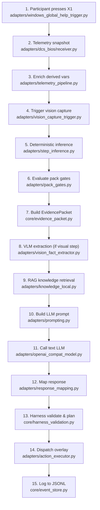
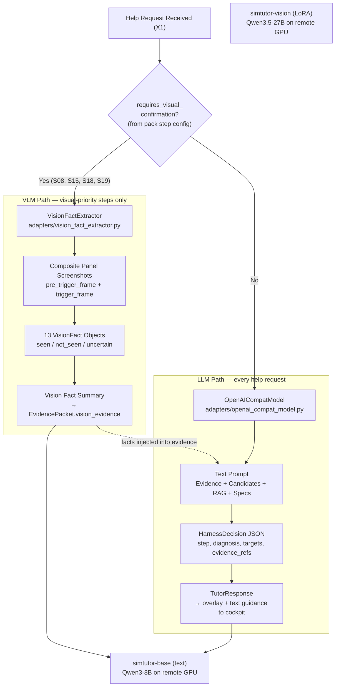
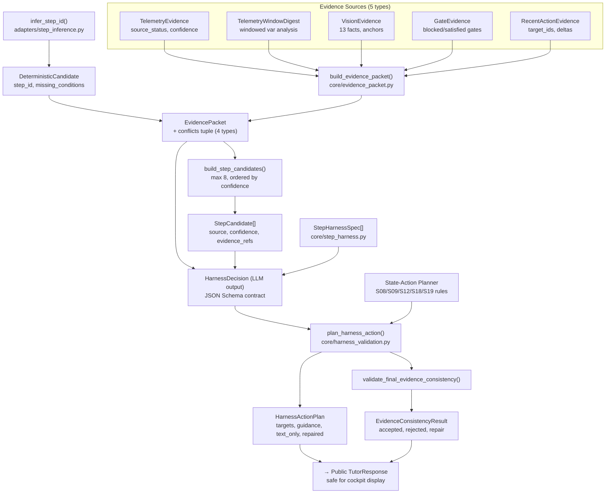
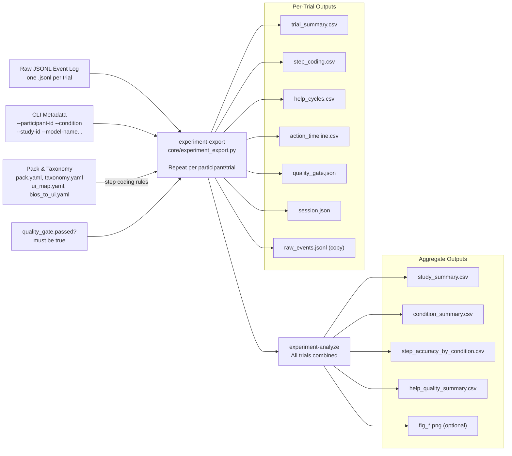
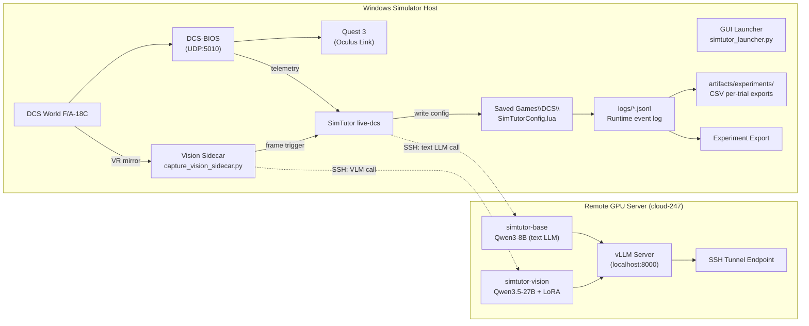

# SimTutor Architecture Diagrams — Mermaid Format

Import into draw.io via: **Arrange → Insert → Advanced → Mermaid**

All six diagrams below. Paste each individually into draw.io.

---

## 1. System Overview

```mermaid
graph LR
  subgraph HW["Hardware / Sim"]
    Q3["Quest 3 HMD<br/>(fixed platform)"]
    DCS["DCS F/A-18C<br/>cold-start mission"]
    BIOS["DCS-BIOS<br/>UDP 239.255.50.10:5010"]
    PACK["Pack Config<br/>packs/fa18c_startup/"]
    VFACTS["Vision Facts<br/>13 facts, sticky"]
  end

  subgraph ST["SimTutor Process (live_dcs.py)"]
    L1["LiveDcsTutorLoop<br/>live_dcs.py"]
    L2["build_help_prompt_result()<br/>adapters/prompting.py"]
    L3["EvidencePacket<br/>core/evidence_packet.py"]
    L4["plan_harness_action()<br/>core/harness_validation.py"]
    L5["OverlayActionExecutor<br/>adapters/action_executor.py"]
    L6["experiment-export<br/>core/experiment_export.py"]
  end

  subgraph RO["Remote & Output"]
    R1["OpenAICompatModel<br/>Qwen3-8B — text LLM"]
    R2["VisionFactExtractor<br/>Qwen3.5-27B — VLM"]
    R3["vLLM Server<br/>Remote GPU"]
    R4["simtutor-base<br/>simtutor-vision (LoRA)"]
    R5["JSONL Event Log<br/>logs/*.jsonl"]
    R6["CSV Artifacts<br/>trial_summary, step_coding..."]
    R7["Analysis Output<br/>study_summary, figures"]
  end

  OVC["SimTutorConfig.lua<br/>DCS overlay config"]

  Q3 --> DCS --> BIOS
  BIOS -->|"telemetry"| L1
  DCS -->|"VR mirror"| L1
  L1 --> L2 --> L3 --> L4 --> L5
  L5 -->|"write config"| OVC
  L3 -->|"evidence for prompt"| R1
  L3 -->|"VLM facts"| R2
  R1 -->|"SSH tunnel"| R3
  R2 -->|"SSH tunnel"| R4
  L5 --> L6
  L6 -->|"freeze trial"| R5
  R5 --> R6 --> R7
  PACK -->|"steps/gates"| L3
```



---

## 2. Live Help Cycle



---

## 3. VLM / LLM Separation



---

## 4. Harness Engineering Objects



---

## 5. Experiment Export and Analysis Pipeline



---

## 6. Deployment Topology



---

## Import Instructions

For each diagram above:

1. Copy the Mermaid code block (including the ```mermaid ... ``` fences)
2. In draw.io: **Arrange → Insert → Advanced → Mermaid**
3. Paste and click **Insert**
4. The diagram renders as native draw.io shapes, fully editable

Alternatively, open the companion `diagrams.drawio` file which contains all six diagrams pre-built on separate tabs and ready to edit.
